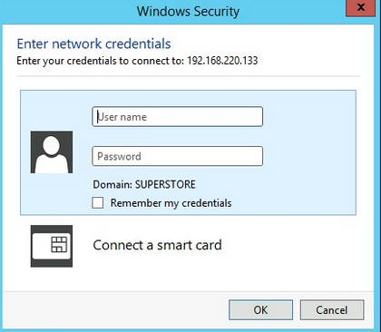
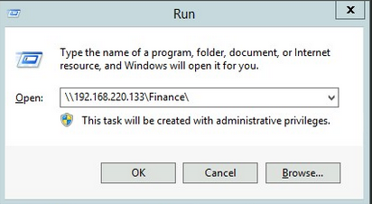

# SMB

## **Windows - Interacting with SMB Share (GUI)**

1.- [WINKEY] + [R]

**2.- Set Share Path - GUI Displayed**



**3.- If you don’t have access to the shared folder, credentials will be requested**



## **Windows - Interacting with SMB Share (CMD)**

```
C:\htb> dir \\192.168.220.129\Finance\
```

## **Windows  - Net Use to interact with SMB Share (CMD)**

```
C:\htb> net use n: \\192.168.220.129\Finance
```

**Using Credentials**

```
C:\htb> net use n: \\192.168.220.129\Finance /user:plaintext Password123
```

**Note**: With the shared folder mapped as the `n` drive, we can execute Windows commands as if this shared folder is on our local compute

### Enumerating Files and Subfolders inside the Share

```
dir n: /a-d /s /b | find /c ":\"
```

### Enumerating Credentials inside the Share

```
C:\htb>dir n:\*cred* /s /b
```

### Enumerating Credentials (or any file) inside the Share using **Findstr**

```
c:\htb>findstr /s /i cred n:\**.**
```

**More examples**

[findstr](https://learn.microsoft.com/en-us/windows-server/administration/windows-commands/findstr#examples)

## **Windows - Interacting with SMB Share (Powershell)**

```powershell
PS C:\htb> Get-ChildItem \\192.168.220.129\Finance\
```

## **Windows  - New-PSDrive to interact with SMB Share (PowerShell)**

```powershell
PS C:\htb> New-PSDrive -Name "N" -Root "\\192.168.220.129\Finance" -PSProvider "FileSystem”
```

**Using Credentials**

```powershell
PS C:\htb> $username = 'plaintext'
PS C:\htb> $password = 'Password123'
PS C:\htb> $secpassword = ConvertTo-SecureString $password -AsPlainText -Force
PS C:\htb> $cred = New-Object System.Management.Automation.PSCredential $username, $secpassword
PS C:\htb> New-PSDrive -Name "N" -Root "\\192.168.220.129\Finance" -PSProvider "FileSystem" -Credential $cred
```

### Enumerating Credentials (or any file) inside the Share using Get-ChildItem

```powershell
PS C:\htb> Get-ChildItem -Recurse -Path N:\ -Include *cred* -File
```

### Enumerating Credentials (or any file) inside the Share using **Select-String**

## **Linux - Mount Share**

```bash
sudo mkdir /mnt/Finance
sudo mount -t cifs -o username=plaintext,password=Password123,domain=. //192.168.220.129/Finance /mnt/Finance
```

**As an alternative, we can use a credential file.**

```bash
mount -t cifs //192.168.220.129/Finance] /mnt/Finance -o credentials=/path/credentialfile
```

**CredentialFile**

```
username=plaintext
password=Password123
domain=.
```

**Note**: Once a shared folder is mounted, you can use common Linux tools such as `find` or `grep` to interact with the file structure. 

### Enumerating Credentials (or any file) inside the Share using find

```bash
 find /mnt/Finance/ -name **cred**
```

### Enumerating Credentials (or any file) inside the Share using grep

```bash
grep -rn /mnt/Finance/ -ie cred
```

# Email - (SMTP, POP3, IMAP)

[ConnectToIMAPandSMTP](https://www.youtube.com/watch?v=xelO2CiaSVs)

# Databases

## Interact with MSSQL using SQSH (Linux)

```bash
sqsh -S 10.129.20.13 -U username -P Password123
```

## **Interact with MSSQL using SQLCMD (Windows)**

```
sqlcmd -S 10.129.20.13 -U username -P Password123
```

## Interact with MySQL using MySQL Client (Linux)

```bash
mysql -u username -pPassword123 -h 10.129.20.13
```

## Interact with MySQL using MySQL Client (Windows)

```
C:\htb> mysql.exe -u username -pPassword123 -h 10.129.20.13
```

## **GUI Applications to Interact with Databases**

### Interact with MSSQL GUI using dbeaver (Linux)

[Releases · dbeaver/dbeaver](https://github.com/dbeaver/dbeaver/releases)

**Install dbeaver**

```
sudo dpkg -i dbeaver-<version>.deb
```

**Run dbeaver**

```
dbeaver &
```

**Connecting to MSSQL DB using dbeaver**

[ConnectToMSSQL](https://www.youtube.com/watch?v=gU6iQP5rFMw)

**Connecting to MySQL DB using dbeaver**

[ConnectToMySQL](https://www.youtube.com/watch?v=PeuWmz8S6G8)

# **Tools to Interact with Common Services**

| **SMB** | **FTP** | **Email** | **Databases** |
| --- | --- | --- | --- |
| [smbclient](https://www.samba.org/samba/docs/current/man-html/smbclient.1.html) | [ftp](https://linux.die.net/man/1/ftp) | [Thunderbird](https://www.thunderbird.net/en-US/) | [mssql-cli](https://github.com/dbcli/mssql-cli) |
| [CrackMapExec](https://github.com/byt3bl33d3r/CrackMapExec) | [lftp](https://lftp.yar.ru/) | [Claws](https://www.claws-mail.org/) | [mycli](https://github.com/dbcli/mycli) |
| [SMBMap](https://github.com/ShawnDEvans/smbmap) | [ncftp](https://www.ncftp.com/) | [Geary](https://wiki.gnome.org/Apps/Geary) | [mssqlclient.py](https://github.com/SecureAuthCorp/impacket/blob/master/examples/mssqlclient.py) |
| [Impacket](https://github.com/SecureAuthCorp/impacket) | [filezilla](https://filezilla-project.org/) | [MailSpring](https://getmailspring.com/) | [dbeaver](https://github.com/dbeaver/dbeaver) |
| [psexec.py](https://github.com/SecureAuthCorp/impacket/blob/master/examples/psexec.py) | [crossftp](http://www.crossftp.com/) | [mutt](http://www.mutt.org/) | [MySQL Workbench](https://dev.mysql.com/downloads/workbench/) |
| [smbexec.py](https://github.com/SecureAuthCorp/impacket/blob/master/examples/smbexec.py) |  | [mailutils](https://mailutils.org/) | [SQL Server Management Studio or SSMS](https://docs.microsoft.com/en-us/sql/ssms/download-sql-server-management-studio-ssms) |
|  |  | [sendEmail](https://github.com/mogaal/sendemail) |  |
|  |  | [swaks](http://www.jetmore.org/john/code/swaks/) |  |
|  |  | [sendmail](https://en.wikipedia.org/wiki/Sendmail) |  |
